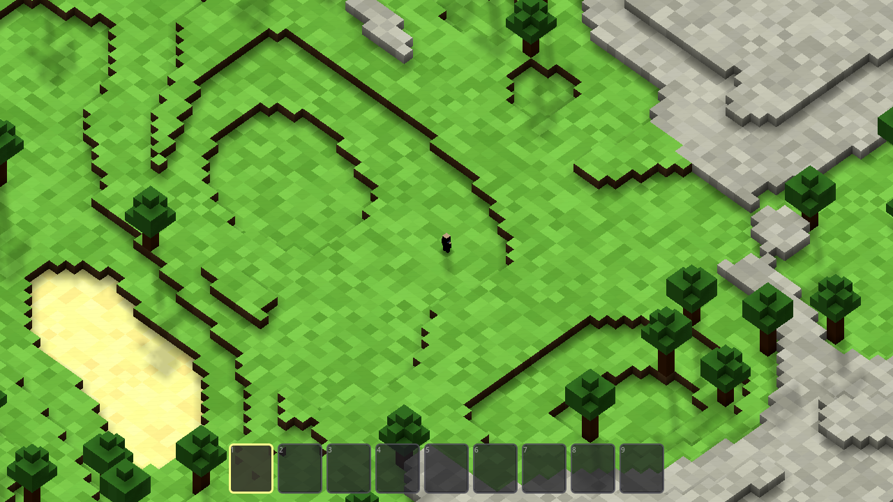
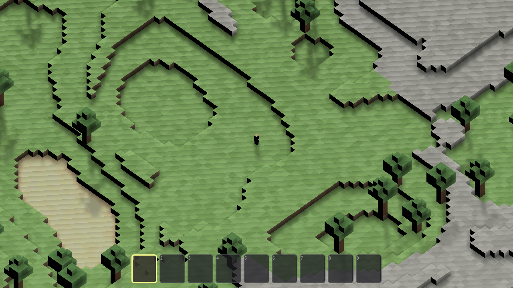
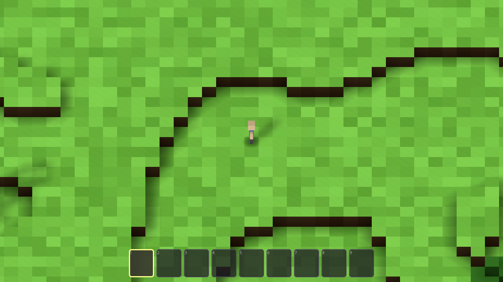
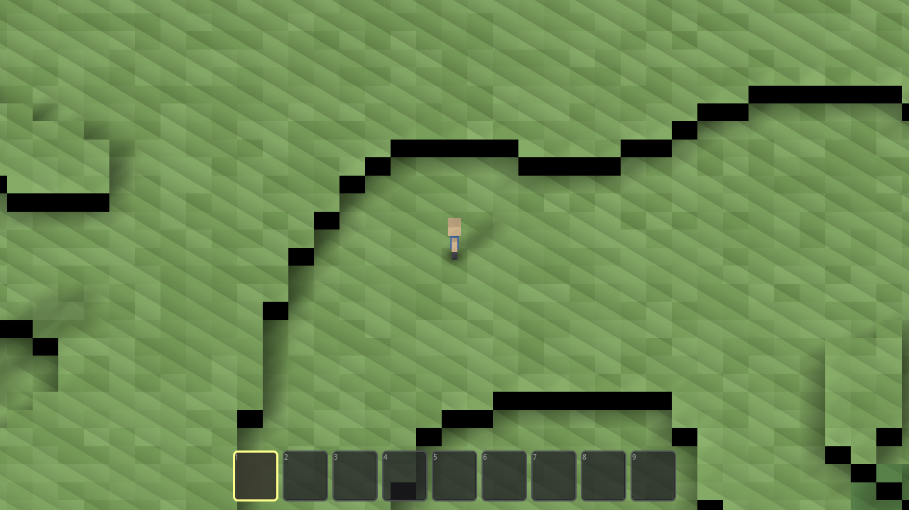

# Wildes — Task 001: Ambient Occlusion and Shadows

<!-- Task overview. See instruction.md for the full spec. -->

This task adds **real-time ambient occlusion and soft visible shadows** to the Wildes
voxel sandbox **without changing gameplay or the flat, high-key art direction**, and
**within the existing Godot 4.7 GL Compatibility renderer** (`gl_compatibility`). AO must
ground block seams, inner corners, and the explorer's feet while leaving open ground
clean; terrain, trees, the explorer, and placed blocks must all cast **stable** shadows
through every camera rotation and zoom; and mining, placing, falling, pausing, returning,
and creating a new world must all leave the lighting correct — with **no acne, detached
shadows, crushed colors, halos, or obvious performance loss**. **"Done"** = the game
launches with no errors or warnings and the lighting reads correctly.

Two agents implemented the same `instruction.md` independently — **Avocado (Muse Spark)**
and **Claude Opus 4.8** — starting from the same committed foundation (the scaffolded
Wildes sandbox, commit `0e4bdf6`), and this task compares them (see _Trajectories_ below). This
comparison is drawn from the two run transcripts, the two working source trees, and the
[`./screenshots/`](./screenshots) I captured by launching **both** projects in Godot 4.7
(`4.7.stable`) and rendering matched frames. (The author's golden reference solution exists
as a paste and a gameplay video — see below — but is intentionally **not** used as a
comparison baseline; the shared gold `src/` committed in the repo is still the scaffolded
sandbox, so the head-to-head is strictly Avocado vs Claude.)

Both delivered the **same core technique**, correctly reasoned: because SSAO is not
available in the Compatibility renderer, both **bake per-vertex, 4-level Minecraft-style
ambient occlusion** during chunk meshing (top face sampled from the layer above, so open
flat ground stays AO-clean), both enable the `Sun` `DirectionalLight3D`'s soft shadows and
flip every chunk mesh to **cast** shadows, both switch `terrain.gdshader` from `unshaded`
to a lit mode, both add a **soft radial contact-shadow patch under the explorer's feet**
that fades and shrinks with jump height, and both independently found and fixed the *same*
pre-existing `water.gdshader` invalid-render-mode error. Both launch with no errors or
warnings. The real differences are almost entirely in **how (and whether) each agent
verified the rendered result** — and that gap shows up directly in the pixels.

## Observations

### The headline difference

The two agents **converge on nearly the same AO + shadow architecture** (baked voxel AO +
real sun shadows + a fading feet contact patch), and **both ran Godot to verify** — Avocado
headless, where it caught and fixed a real shader-compile error. What still separates them
collapses to a single thing: **whether the agent looked at the rendered output.** Claude
did; Avocado couldn't. And that is exactly what let a real, visible defect through —
crushed, near-black AO seams (see _Visual comparison_).

### Process (how the work got verified)

| Evaluation | Claude (Opus 4.8) | Avocado (Muse Spark) | Track opportunity |
| --- | --- | --- | --- |
| **Engine in the loop** | Ran Godot 4.7 **~13 times**, **windowed** (`--rendering-driver opengl3`, forcing the Compatibility/GL path). Error curve was monotonic **1 → 0**; final full-log run: "the game runs completely clean — no errors or warnings." | Ran Godot 4.7 **~5 times, headless only** (`--headless --quit`). Located it via `/Applications/Godot.app` after `which godot` failed; confirmed `4.7.stable`. Final headless run: "no shader errors/warnings, world generates 100 chunks." | Reward autonomous engine-in-the-loop verification — and note that *both* agents clear this bar. |
| **Durability of the tests** | No committed suite (project ships none). Built a throwaway screenshot harness (`_shot/`), then **deleted it** and `grep`-verified no dangling `.godot` refs. | No committed suite and **no harness**; all edits went through the structured edit tool (no probe scripts). | Neither shipped durable tests — an open slot to reward a committed check the next agent can re-run. |
| **Render-path check** | **Yes — looked at pixels.** Rendered **~10 PNG frames** across default / zoom / multiple camera rotations / a scripted mine-a-pit + build-a-tower edit, `Read` them, and checked each spec hazard against the image ("no acne, no detached shadows, no halos, no crushed colors"). | **None.** Explicitly "we should test visually, but can't run graphical" / "not possible" to screenshot. Verified **stdout logs only** — every claim about AO darkness, crushed colors, acne, and art-direction shift was reasoned in the abstract, never observed. | Reward verification that inspects **rendered output**, not just the error log — this is where the defect below hides. |
| **Debugging under failure** | Fixed in **code**. Hit the shared `water.gdshader` error and **renamed** the mode to the correct `depth_prepass_alpha` (preserving the alpha prepass). Probed an isolated `/tmp` project to learn `AMBIENT_LIGHT` can't be written in `fragment()` under Compatibility (steering the design), and **lifted the AO floor after looking at the first render** to avoid crushed colors. | Fixed in **code**. Hit the same `water.gdshader` error and **removed** the invalid mode (added `shadows_disabled`); proactively removed `depth_test_disabled` from its contact-shadow shader to avoid a halo. All reasoning-driven — no bug was ever *seen*. | Reward finding/fixing render bugs that are invisible without rendering (Claude's AO-floor lift is exactly this). |
| **Speed** | **~18–22 min** (estimate; no in-transcript timestamps — active edit window `15:08–15:22` from file mtimes, plus read/probe/verify). | **~11m25s** wall-clock (real header timestamps `2:34:40 → 2:46:05 PM`; ~11.4 min model generation, single continuous autonomous run). | The faster run was faster largely because it **skipped the render check** — speed shouldn't be rewarded apart from the correctness evidence it traded away. |

### Implementation & architecture (from the source + transcripts)

Both build on the same `0e4bdf6` scaffold, keep the `gl_compatibility` renderer unchanged,
bake 4-level per-vertex voxel AO in `world_generator.gd`'s chunk mesher, enable the `Sun`
shadows and set chunk meshes to cast, and add a fading feet contact patch. The differences
are in **where AO is stored, whether the flat art direction is protected, and whether the
result was tuned against pixels**.

| Aspect | Claude (Opus 4.8) | Avocado (Muse Spark) |
| --- | --- | --- |
| Lines added (this task) | **~173 across 7 files** (all modified; no new file) | **~233 across 6 files** (5 modified + **1 new shader**) |
| `world_generator.gd` / `player_explorer.gd` Δ | **+64 / −11** and **+59** | **+118 / −16** and **+70** |
| AO storage | Baked into vertex **`COLOR.a`**, read via `v_ao` with a **tunable `ao_strength = 0.55`** uniform + `shadow_floor = 0.6` (LUT `[0.52, 0.70, 0.86, 1.0]`) | Multiplied **directly into vertex RGB**, **fixed** levels `1.0 / 0.82 / 0.68 / 0.58`, no shader-side control |
| AO anisotropy | **Flips the quad split-diagonal** toward the brighter corner pair ("classic voxel-AO fix") | Fixed winding — **no flip** → lopsided dark triangles (visible below) |
| Art-direction preservation | Custom **`light()`** applies **only** the sun's shadow term (`ATTENUATION`), face-gated, floored — **no N·L relight**, flat albedo preserved | Relies on engine **default `diffuse_lambert`** → a per-face directional gradient (real art-direction shift; the agent flagged the risk but never verified) |
| Directional shadow config | `directional_shadow_mode = 0` (single Orthogonal), `max_distance 260`, `pancake 40`, `bias 0.04`, `normal_bias 1.4`, `blur 1.5`; **`project.godot` shadow map bumped to 4096 + soft filter q3** | `directional_shadow_mode = 1` (PSSM 2-split), `blend_splits`, `pancake 180`, `filter 1` (PCF5), `bias 0.015`, `normal_bias 0.55`, `blur 0.8`, `opacity 0.68`; no `project.godot` change |
| Feet contact patch | Inline shader string in `player_explorer.gd`, `QuadMesh 1.5×1.5`, `strength 0.3`, fades over 2.5 units | Dedicated **`contact_shadow.gdshader`** (23 lines), `PlaneMesh 1.6×1.6`, `radius 0.9`, alpha `0.38 → 0.12` when airborne |
| Water-shader fix | Renamed to correct `depth_prepass_alpha` | Removed the mode + added `shadows_disabled` |
| Docs | Added a "Lighting: Ambient Occlusion & Soft Shadows" section to `src/README.md` | None |

The paradox here: Avocado wrote **more** code and **more** bespoke tech (a
standalone contact-shadow shader, denser AO), reasoned about every named hazard — and
verified **none** of it against a rendered frame. Claude wrote leaner, more tunable code
(AO in the alpha channel behind a uniform, a cel-preserving `light()`, an anisotropy flip)
and **rendered, inspected, and re-tuned** it.

### Visual comparison (from `./screenshots/`)

Both projects generate the **identical** world (`seed_value = 1337`, unchanged by both), so
these frames are directly comparable — the terrain, trees, sand pond, and stone ridge line
up exactly, and only the lighting differs.

| State | Claude (Opus 4.8) | Avocado (Muse Spark) |
| --- | --- | --- |
| **Spawn / open meadow** | Bright, high-key **cel look preserved**; block seams grounded with **soft brown** AO; open ground stays clean; readable | **Darker, muddier**; block seams crushed to **near-black aliased zigzags**; a faint diagonal AO hatch appears even on open ground |
| **Close-up (zoom)** | Flat ground clean; 1-block step seams read as **soft brown** grounding; no acne, no crushed colors | **Pure-black rectangular seam bands** (crushed colors) and a pervasive **diagonal AO triangulation** across flat ground; lopsided triangles |
| **Camera rotation** | Trees & the stone ridge cast **clean, stable soft shadows**; the flat palette holds through the turn | Shadows are hard to separate from the crushed AO; the scene stays dark/noisy through rotation |

Both ship the *same algorithm*, but the outcome diverges sharply. Claude's choices — AO in
`COLOR.a` behind a gentle `ao_strength`, a `shadow_floor` so nothing crushes to black, the
split-diagonal flip, and a `light()` that never relights the flat albedo — plus the fact
that it **looked at the render and lifted the AO floor once it saw it**, produce a clean,
spec-faithful, art-direction-preserving image. Avocado — which reasoned carefully about
"avoid acne, crushed colors, halos" but **never rendered a pixel** — ships exactly the
crushed-colors/acne-like artifact it worried about: multiplying AO straight into vertex RGB
down to `0.58`, combined with default Lambert relighting and no anisotropy flip, crushes
seams to near-black and stipples open ground with a diagonal AO hatch. The lesson: a
single glance at a rendered frame would have caught it.

### Bottom line

Both agents correctly identified the Compatibility → bake-AO constraint and delivered the
same architecture (per-vertex voxel AO + real `DirectionalLight3D` soft shadows + a fading
feet contact patch), both launch with **no errors or warnings**, and Avocado **ran Godot
headless and self-fixed a real shader error.** The separation is the render-path check: Claude rendered
~10 frames and **looked at them**, tuning AO and shadows against pixels — soft brown seams,
clean open ground, the flat art direction intact — and shipped a clean result; Avocado
verified only console logs and shipped **visibly crushed, near-black AO seams and a
diagonal AO hatch on open ground**, the exact hazards it had enumerated but never saw. The
open track opportunity: keep rewarding autonomous engine-in-the-loop verification that
inspects **rendered output** (not just the error log), and reward **art-direction-preserving
technique** (a cel-safe `light()`, an AO floor, an anisotropy fix) over raw code volume.

## Videos

Gameplay recordings (uploaded to PixelCloud — do not commit video files):

- **Golden solution (author reference):** [pxl.cl/bP5ZR](https://www.internalfb.com/intern/px/p/bQ1PB) — gameplay of the shipped reference build.

## Trajectories

Agent run logs:

- **Avocado (Muse Spark):** [P2430815124](https://www.internalfb.com/phabricator/paste/view/P2430815124) — ran Godot **headless only**; baked RGB voxel AO + engine shadows + a standalone contact-shadow shader; self-fixed the water-shader error; ~11m25s; **never rendered a pixel**.
- **Claude (Opus 4.8):** [P2430815501](https://www.internalfb.com/phabricator/paste/view/P2430815501) — ran Godot **windowed ~13×**, rendered and **inspected ~10 frames** across rotation/zoom/mining; AO in `COLOR.a` + cel-preserving `light()` + 4096 shadow map; lifted the AO floor after looking; ~18–22 min.
- **Golden (author reference):** [P2430814606](https://www.internalfb.com/phabricator/paste/view/P2430814606) and [P2432253878](https://www.internalfb.com/phabricator/paste/view/P2432253878) — reference; not compared.

## Artifacts

- Screenshots: [`./screenshots/`](./screenshots) — `avocado/` and `claude/`, each with `spawn.png`, `zoom.png` (close-up), and `rotate.png` (post-rotation). All captured by launching each workspace in Godot 4.7 (`4.7.stable`) via a throwaway screenshot harness that was removed after use; the agents did not ship screenshots (Claude rendered and then deleted its own).
- Binaries: none. Neither agent exported a build in its trajectory (no `--export`); run from source — `godot --path src` (or open `src/` in the Godot 4.7 editor and press Play).
