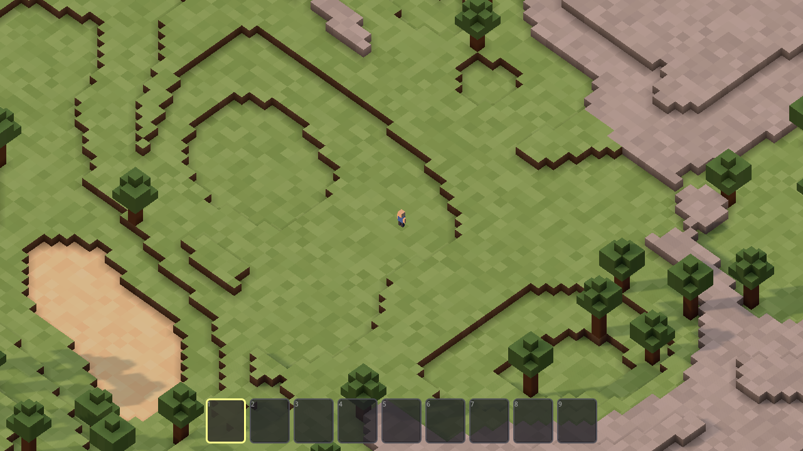
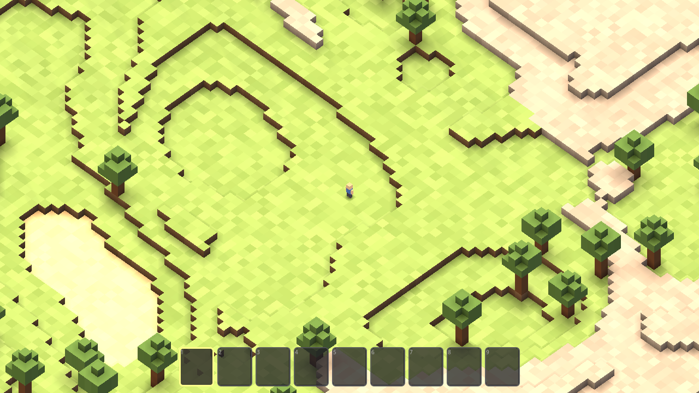
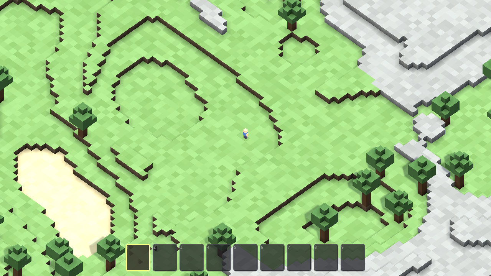
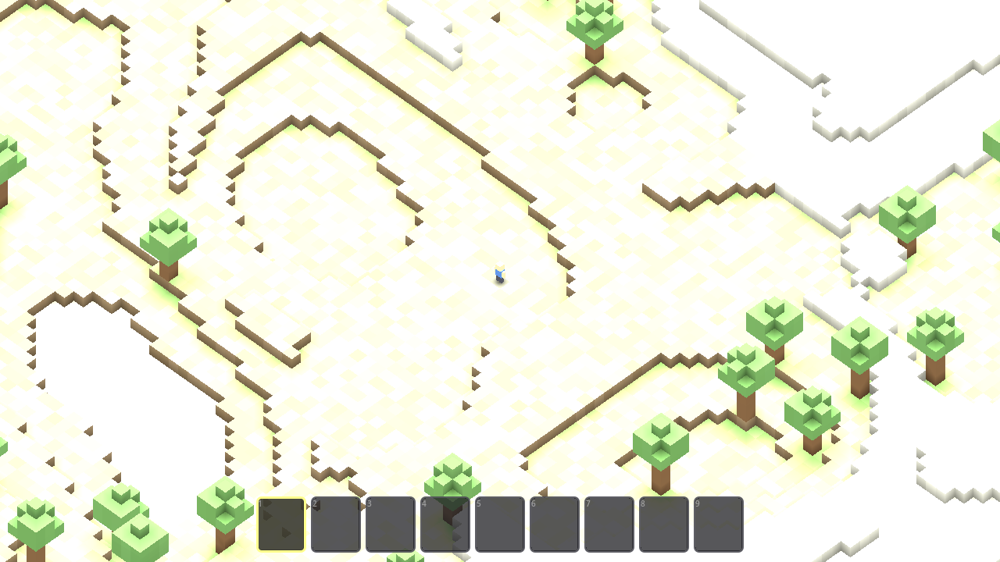
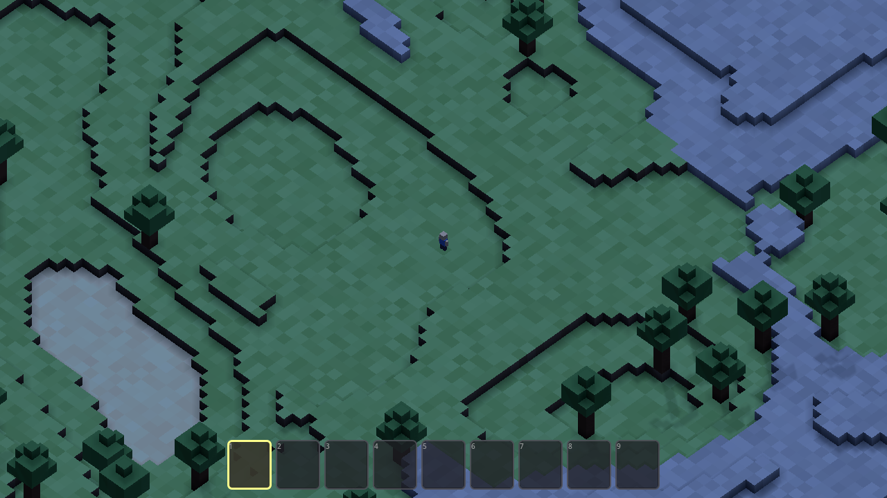
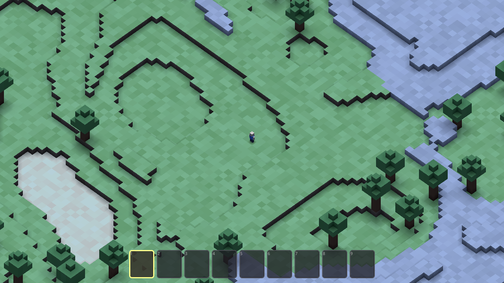

# Wildes — Task 002: Day and Night Cycle w/ Real-Time Shadows

<!-- Task overview. See instruction.md for the full spec. -->

This task adds a **repeating ~20-minute day/night cycle** — **10 minutes of daylight, 10
minutes of night** — to the Wildes voxel sandbox, on top of the Task-001 foundation (which
already provides the baked ambient occlusion and soft shadows). Sun and moon lighting, sky,
ambient color, brightness, and **real-time directional shadow direction** must move
continuously through **sunrise (6–8 AM), daytime (8 AM–5 PM), sundown (5–7 PM), and night
(7 PM–6 AM)**. Shadows are cast by the **sun and the moon**, must be **soft and smooth with no
hard edges or discontinuities**, and must affect **both the player and blocks**. Nights stay
**playable — a cool low light, not black terrain** — the clock advances **only during active
play**, and a **new world starts at sunrise**. Mining and placement must immediately use the
current lighting; **ambient occlusion and existing gameplay stay unchanged** (they are
inherited, not reimplemented); and there must be **no lighting jumps, double shadows, flicker,
washed colors, or visible cycle seams**. A **debug panel toggled with `=`** exposes a
time-of-day slider. **"Done"** = the game runs with no errors or warnings and the lighting
reads correctly through the whole cycle.

Two agents implemented the same `instruction.md` independently — **Avocado (Muse Spark)** and
**Claude Opus 4.8** — each starting from the **Task-001 source** (AO + soft shadows already in
place), and this task compares them (see _Trajectories_ below). This comparison is drawn from
the two run transcripts, the two working source trees, and the [`./screenshots/`](./screenshots)
I captured by launching **both** projects in Godot 4.7 (`4.7.stable`) on the GL Compatibility
renderer and rendering matched frames at the golden hour (a low-sun sunrise/sundown frame),
noon, and midnight via each controller's time API. (The author's golden day/night reference
solution exists as a paste and a gameplay video — see below — but is intentionally **not** used
as a comparison baseline; the shared gold `src/` committed in the repo is still the Task-001
source, so the head-to-head is strictly Avocado vs Claude.)

Both delivered a working day/night cycle on the same 24-hour float clock, both matched the
spec's schedule exactly, both keep the AO and gameplay untouched, both give night a **cool blue
low light** (not black), both drive **smoothstep-interpolated keyframe color tables** that wrap
`0 == 24` (no seam), both **start a new world at sunrise** and advance the clock **only during
active play**, and both add a code-built **debug panel toggled with the raw `=` keycode**
carrying an `HSlider`. Both run Godot 4.7 and finish with no errors or warnings. But this time
the two **diverge sharply on approach** — Avocado adds a second `Moon` light and toggles which
of two lights casts; Claude reuses a **single key light** as sun-by-day / moon-by-night so a
second shadow can never exist — and, once again, on **whether the agent looked at the rendered
result**: Claude rendered the whole cycle and tuned it against pixels; Avocado ran only
headless and shipped a blown-out noon.

## Observations

### The headline change from the previous task

For the first two tasks the story was convergence — both agents landing on nearly the same
architecture. This task **breaks that pattern**: given the same Task-001 base, the two now
pick **materially different shadow architectures**. Avocado adds a **second `Moon`
`DirectionalLight3D`** and flips `shadow_enabled` between the two lights each frame; Claude uses
**one key light** that becomes the sun by day and the moon by night, so there is only ever a
single caster and **double shadows are structurally impossible**. Claude also turns on **real
cast shadows for the player and blocks** (`cast_shadow = ON`), so the player's own shadow
rotates with the light through the day. What still separates the results, for the third task
running, is the render-path check: Claude **rendered the cycle and looked at it**, catching and
fixing its own overexposed noon; Avocado **never rendered a pixel** and shipped a near-total
white-out at noon where colour *and* shadows vanish.

### Process (how the work got verified)

| Evaluation | Claude (Opus 4.8) | Avocado (Muse Spark) | Track opportunity |
| --- | --- | --- | --- |
| **Engine in the loop** | Ran Godot 4.7 **windowed / rendered** (OpenGL 4.1 Metal Compatibility, Apple M4 Pro), plus a plain `--quit-after` scene run grepped for errors. Error curve: clean compile → one **visual** failure (overexposed noon) → fixed → clean. **Final: PASS**, "zero errors or warnings," verified twice. | Ran Godot 4.7 **headless only** (`--headless --quit --verbose`), **~7 runs — first 4 FAIL, last 3 PASS**. Located Godot at `/Applications/Godot.app` after `which godot` failed; confirmed `4.7.stable`. Final headless run clean: `[DayNight] Ready`, **no errors/warnings**. | Reward autonomous engine-in-the-loop verification — both clear the headless bar; only one clears the *render* bar. |
| **Durability of the tests** | No committed suite (project ships none). Built a **throwaway** `_screenshot_runner.gd` (~52 lines) that instantiated the real scene, pinned the time, and saved PNGs; extended it twice, then **`rm -f`**'d it. | No committed suite and **no harness or probe scripts** at all — every edit went through the structured edit tool. | Neither shipped a durable, re-runnable check — an open slot for the next agent. |
| **Render-path check** | **Yes — looked at pixels, extensively.** Rendered and `Read` frames at **noon ×3**, dawn `t=6`/`t=7`, daytime, sundown `t=18`, dusk→night `t=19`, night `t=22`, **plus a zoomed player-shadow shot proving it rotates** and a block-placement shot. It **explicitly checked and tuned noon exposure** against the image. | **None.** Headless only — it **never saw a rendered frame**. Every visual criterion (soft shadows, no double-shadows, "cool low light not black," no washed colors/seams) was reasoned about, **never pixel-verified**. | Reward verification that inspects **rendered output** across the whole cycle — exactly where the noon defect hides. |
| **Debugging under failure** | Its bugs were **visual, found by looking, and fixed in code**: (1) **noon overexposed** → lowered key `1.05→0.78`, fill `0.40→0.26`, ambient `1.02→0.22`; (2) **spawn too dark** at `start_time=6.0` (pre-dawn) → `7.0` (mid-sunrise); (3) **shadows too short** → `base_elevation 52→46°`, `dawn/dusk dip 22→18°`. Re-rendered and confirmed each. | Its bug was **self-inflicted and non-visual**: a call/definition name mismatch (`_ready()` called `_find_nodes()`, defined `_test_nodes()`) plus an invalid 12-arg `Transform3D` literal. It **misdiagnosed the mismatch as a `.godot` script-cache problem** and burned most of the run on `rm -rf .godot`, a `/tmp` symlink, and byte inspection before finding the rename. | Reward finding/fixing **render-only** defects (Claude's noon + shadow-length fixes are exactly this); they are invisible to a headless log. |
| **Speed** | **~36m58s** (self-reported footer "Worked for 36m 58s"; no per-message timestamps — Jul-24 file mtimes `19:59 → 20:11` are consistent). | **~7m43s** wall-clock (real header timestamps `5:45:19 → 5:53:02 PM`). | The faster run was faster largely because it **skipped the render check** and then spent its time on a self-inflicted cache goose chase — speed shouldn't be rewarded apart from the correctness evidence it traded away. |

### Implementation & architecture (from the source + transcripts)

Both inherit the Task-001 foundation (baked AO, lit terrain that receives shadows) **unchanged**
and add a single day/night controller node. From there they diverge on the **shadow
architecture, the pacing, and — decisively — whether noon was tuned against a rendered frame**.

| Aspect | Claude (Opus 4.8) | Avocado (Muse Spark) |
| --- | --- | --- |
| This task's work | **`day_night_cycle.gd` (328 lines / 280 non-blank)** + `cast_shadow = ON` flips for chunks (1 line) and the player's torso/head/legs/arms (4 lines) + `main.tscn` wiring + energy tuning; `main.gd` untouched | **`day_night_controller.gd` (549 lines / 488 non-blank)** + `main.tscn` wiring (adds a `Moon` node, `SunFill` → static `0.22`); no gameplay-script edits |
| Architecture | **Single-file controller** (`DayNightCycle` node) driving the existing `Sun`/`SunFill`/`WorldEnvironment` by `NodePath`; debug UI self-contained in the same file | **Monolith**: clock, two lights, sky, shadows, **and** the debug UI (`_create_debug_ui`) all in one controller |
| Sun / moon + shadows | **One key `DirectionalLight3D` does double duty** — sun by day, moon by night (color+energy lerp) — so there is **only ever one caster: double shadows are impossible, no hand-off seam**. `SunFill` casts nothing | **Two lights**: adds a `Moon` `DirectionalLight3D`; per-frame `sun.shadow_enabled = (6 ≤ t < 19)`, moon otherwise → single caster **via a toggle** (a hand-off at t=6 and t=19, softened but discrete) |
| Player & block shadows | Flips **`cast_shadow = ON`** on chunks and the player parts → the player casts a **real directional shadow that rotates** with the light (spec: "shadows affect both the player and blocks") | Blocks cast (inherited); the player keeps the **inherited static feet patch** (does not rotate with the sun) |
| Cycle pacing | **Exact 10 / 10.** `daylight_seconds = 600` + `night_seconds = 600`; dual-rate `_advance_time` paces the 13-hour day window (6→19) and the 11-hour night window (19→6) each into **exactly 10 min** | **Approximate.** Constant rate `cycle_duration = 1200 s` for a full 24 h → day window ≈ **10.8 min**, night ≈ **9.2 min** (its own comment says "10 min … approx") |
| Sun/moon path | Azimuth `= t/24·360° + 35°` rotates continuously and wraps `360° ≡ 0°`; elevation `= 46° − golden·18°` (dips at dawn/dusk for **long shadows**, ~46° at midnight so the "moon" is up and casting) | Sun arc `0→π` (6–19) then `π→2π` (19–6); `sun_dir` diagonal for longer shadows; `moon_dir = −sun_dir`; horizon clamp avoids a degenerate horizontal light |
| Shadow config | PSSM `SHADOW_PARALLEL_4_SPLITS`, `blend_splits`, splits `0.08/0.20/0.50`, `max_distance 220`, `fade_start 0.9`, **`blur 1.4`**, `bias 0.03`, `normal_bias 1.4`, `opacity = lerp(0.55, 0.92, day)` | PSSM `SHADOW_PARALLEL_4_SPLITS`, splits `0.12/0.30/0.65`, `max_distance 220`; sun `blur 0.9`/moon `blur 1.0`, `bias 0.06/0.07`; **shadow `opacity` lerped by elevation** to a horizon floor to soften the caster swap |
| **Noon exposure** | **Clean high-key** — key `0.78` / fill `0.26` / ambient `0.22` (tuned down from `1.05` after **seeing** the overexposure); an in-code comment documents the shader `×1.22` constraint. Grass keeps its color, stone stays grey | **Overexposed / washed** — key `1.22` + ambient up to `1.48` (floor `night_ambient_min 0.62`) blows grass to pale yellow-white and clips stone/sand to pure white; the wash also **erases the shadows** (see _Visual comparison_) |
| Night "cool low light" | Key `0.26` `(0.60,0.71,1.0)` + fill `0.10` + ambient `0.20` `(0.44,0.54,0.80)`, sky `(0.055,0.085,0.17)`; terrain visible, not black | Ambient `(0.36,0.44,0.62)` @ `0.68` (floor `0.62`) + moon `(0.70,0.76,0.96)` @ `0.52`; terrain visible, not black |
| Debug panel (`=`) | Inline `_build_debug_panel` (`CanvasLayer` `layer 128`); `HSlider` 0–24 step 0.02, live `HH:MM AM/PM — Phase` label, "Freeze time" checkbox; toggle via `_unhandled_input` `KEY_EQUAL` (raw keycode); `set_debug_time` freezes + applies immediately | Inline `_create_debug_ui` (`CanvasLayer` `layer 100`), `Panel` 380×260; `HSlider` 0–24 **plus** an "Auto Advance" checkbox, a "Reset to Sunrise" button, and sun-degrees/cycle-seconds readouts; toggle via `_input` `KEY_EQUAL`/`KEY_PLUS` |
| Minor issues | `project.godot` editor re-save dropped the pinned shadow-map size (`4096`) and `config/name` — reverts to Godot defaults (harmless, but no longer pinned) | `main.tscn` `load_steps` left at `6` despite an added `ext_resource` (harmless latent inconsistency; Godot tolerates it) |

The Task-001 paradox recurs on process, but the architecture flips: this time **Claude wrote
less code (328 vs 549 lines)** with the cleaner design — one light that can never double-shadow,
real rotating player/block shadows, exact pacing — **and rendered, inspected, and re-tuned** it.
Avocado wrote **more** code with a two-light toggle and a richer debug panel, and verified
**none** of the visual result against a rendered frame.

### Visual comparison (from `./screenshots/`)

Both projects generate the **identical** world (`seed 1337`), so these frames are directly
comparable — the terrain, trees, sand pond, and stone ridge line up exactly, and only the
lighting differs. All six were captured by launching each workspace in Godot 4.7 and setting
the controller's time to a golden-hour low sun (sunrise/sundown), noon (12:00), and midnight
(0:00).

| State | Claude (Opus 4.8) | Avocado (Muse Spark) |
| --- | --- | --- |
| **Golden hour (sunrise / sunset)** | Warm low-sun light with **clearly visible long, soft directional shadows** (cast beside the trees and across the sand pond) — the "moving real-time shadows" the spec asks for | Warmer and **paler / hazier**; readable, but **little visible directional shadow** — the low sun reads mostly as a flat warm tint |
| **Noon (12 PM)** | **Clean high-key** — vivid green grass preserved; short cast shadows stay faintly visible (short because the sun is near-overhead) with AO seams still reading; only naturally-light stone approaches white | **Near-total white-out** — grass, sand, and stone all blow to pale cream/white so terrain **colour is essentially gone** (only tree canopies survive) and the player is a barely-visible dot; **the cast shadows and even the AO seam lines wash out entirely — no visible shadows in this frame**. The spec's "washed colors" **and** "shadows visible through noon" both fail |
| **Midnight (12 AM)** | **Cool blue, playable** — terrain fully visible, moonlit, with deep blue AO contours; not black | **Cool blue, playable** — terrain fully visible, slightly lighter; not black |

Both agents get the **cool, playable, not-black midnight** right (their night ambient values are
close). The divergence is at the **lit end of the cycle**. Claude's golden-hour frame shows the
task's headline feature — **long, soft directional shadows that move with the sun** — and its
noon stays colour-correct with faint short shadows because it **rendered the frame and tuned the
energies down when it saw the clipping**. Avocado, which reasoned carefully about "avoid washed
colors" but **never rendered a pixel**, shows little directional shadow at the low-sun frames and
ships a **noon white-out** in which both the terrain colour and the shadows disappear — the exact
hazards it had enumerated but never saw.

### Bottom line

Given the same Task-001 base, both agents produced a working ~20-minute day/night cycle on a
24-hour clock, matched the spec's schedule exactly, kept AO and gameplay untouched, gave night a
**cool playable low light** (not black), and finished with **no errors or warnings**. From
there Claude is the stronger solution on nearly every axis that matters for this task: a cleaner
**single-key-light** design where a second shadow **cannot** exist (vs Avocado's two-light
toggle with a discrete hand-off), **real rotating cast shadows on the player and blocks**,
**exact 10/10 pacing** (vs Avocado's ~10.8/9.2), and — decisively — it **rendered the whole
cycle, caught its own overexposed noon, and fixed it**, shipping visible long soft shadows at
dawn/dusk and a colour-correct noon. Avocado was **~5× faster** but **never rendered a frame**,
and shipped a **noon white-out where colour and shadows both vanish**, plus little visible
directional shadow at the low-sun frames. The open track opportunity is unchanged and now
three-for-three: keep rewarding autonomous engine-in-the-loop verification that **inspects
rendered output across the whole cycle** (not just the headless error log), and reward
**render-tuned exposure, exact pacing, and shadow designs that can't double** over raw code
volume.

## Videos

Gameplay recordings (uploaded to PixelCloud — do not commit video files):

- **Golden solution (author reference):** [pxl.cl/bSKRZ](https://pxl.cl/bSKRZ) — gameplay of the shipped reference build.

## Trajectories

Agent run logs:

- **Avocado (Muse Spark):** [P2436655921](https://www.internalfb.com/phabricator/paste/view/P2436655921) — ran Godot **headless only** (~7 runs, first 4 FAIL); one monolithic `day_night_controller.gd` (549 lines) with a two-light Sun/Moon toggle and an inline debug panel; misdiagnosed a name mismatch as a `.godot` cache bug; ~7m43s; **never rendered a pixel** → shipped an overexposed noon.
- **Claude (Opus 4.8):** [P2436656276](https://www.internalfb.com/phabricator/paste/view/P2436656276) — ran Godot **windowed / rendered**, rendered and **inspected** frames across the cycle (incl. a rotating player-shadow shot); single `day_night_cycle.gd` (328 lines) with one key light reused as sun/moon and real player/block cast shadows; exact 10/10 pacing; **saw its noon clip to white and lowered the energies**; wrote and deleted a screenshot harness; ~36m58s.
- **Golden (author reference):** [P2436655475](https://www.internalfb.com/phabricator/paste/view/P2436655475) — reference; not compared.

## Artifacts

- Screenshots: [`./screenshots/`](./screenshots) — `avocado/` and `claude/`, each with `sunrise_sunset.png` (golden hour), `noon.png`, and `midnight.png`. All captured by launching each workspace in Godot 4.7 (`4.7.stable`) on the GL Compatibility renderer via a throwaway autoload harness that set each controller's time and saved the viewport; the harness was not committed. (Claude rendered and inspected its own frames in-trajectory; Avocado never rendered any.)
- Binaries: none. **Neither agent exported a build in its trajectory** (no `--export` step in either transcript, and no build artifact in either workspace). Run from source — `godot --path src` (or open `src/` in the Godot 4.7 editor and press Play).
</content>
