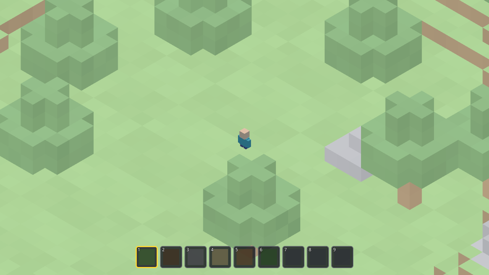
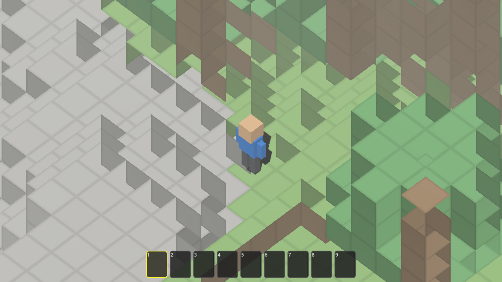
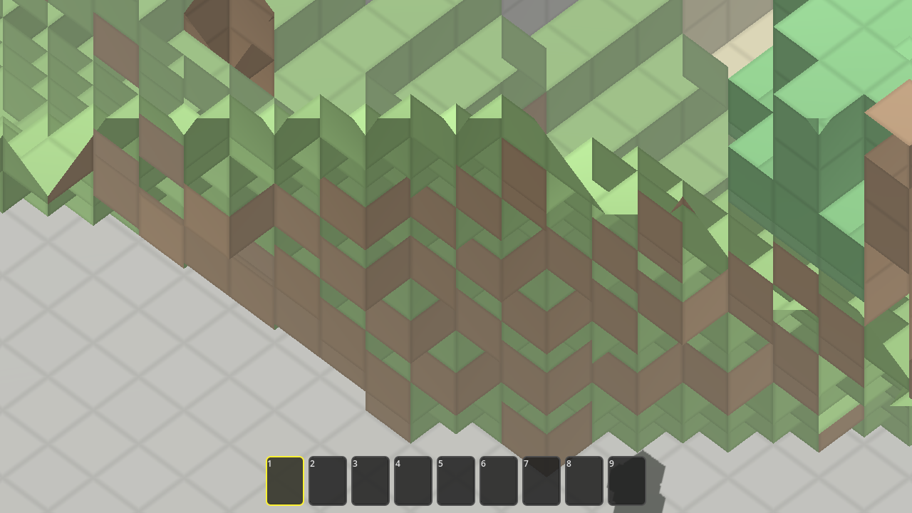

# Wildes — Task 000: Scaffold for Wildes

<!-- Task overview. See instruction.md for the full spec. -->

This task scaffolds **Wildes**, a polished isometric 3D voxel sandbox in **Godot 4.7**.
The player explores one continuous, session-local **200×200** world, mines terrain, and
builds freely. It must generate a seeded world (open meadow spawn near trees and exposed
stone, grading out to sandy lowlands, wooded rises, and stone ridges), render crisp cubes
with readable face shading, and drive a blocky explorer under an orthographic isometric
camera (camera-relative WASD, space to hop, Q/E 45° turns, scroll zoom, smooth follow,
world-edge haze). Blocks come from six collectible/placeable types (grass, dirt, stone,
sand, wood, leaves); reachable blocks get a yellow outline, a held block gets a ghost
preview, hold-LMB mines with a per-block hold time and a pulse effect, RMB places and
consumes one, and a nine-slot hotbar (keys 1–9) shows counts. Reach is **6 blocks**, and
every rejection (occupied / out-of-reach / world-edge / player overlap / empty slot /
destination changed) must fail without consuming inventory. **"Done"** = the game launches
with no errors or warnings, and the player can see a correctly-framed world with the camera
never stuck inside blocks.

Two agents implemented the same `instruction.md` independently — **Avocado (Muse Spark)**
and **Claude Opus 4.8** — from the same empty scaffold, and this task compares them (see
_Trajectories_ below). This comparison is drawn from the two run transcripts, the two
working source trees, and spawn screenshots I captured by launching each project in Godot
4.7. (The golden solution in the repo's `src/` is the author's own reference and is
intentionally **not** used for comparison.)

Both delivered a feature-complete-on-paper scaffold that launches into a playable isometric
world: a seeded 200×200 voxel terrain, the six-block palette (`AIR=0, GRASS, DIRT, STONE,
SAND, WOOD, LEAVES`), a **6-block** reach, per-block mining hold times, the full
placement-rejection set, a nine-slot hotbar on keys 1–9, camera-relative movement with Q/E
45° turns and scroll zoom, and world-edge haze. I launched both and confirmed each starts
without crashing, with the player visible and the camera outside the terrain — but only
Claude's world renders *correctly*: Avocado ships a visible face-shading bug (below). The
real differences are almost entirely in **process** — how (and whether) each agent verified
its own work — and secondarily in architecture and polish.

## Observations

### The headline change from the previous task

This is **Task 000** — the inaugural scaffold for Wildes, so there is no prior task in this
series to diff against; it sets the baseline. The interesting split is not *what* got built
(the two agents converge on nearly the same spec-shaped feature set and constants) but *how
it was validated*. One agent had the Godot engine and used it relentlessly; the other never
ran it at all. That single fact drives most of what follows.

### Process (how the work got verified)

| Evaluation | Claude (Opus 4.8) | Avocado (Muse Spark) | Track opportunity |
| --- | --- | --- | --- |
| **Engine in the loop** | Ran Godot 4.7 **20+ times**: headless `--import`/`--editor` scans, headless runtime runs, and windowed Metal renders. Agent's final headless run reported no errors/warnings/leaks across **600 frames**. | **Never ran Godot once.** Its one probe (`which godot`/`ls /Applications`) returned "godot not found," and it concluded it couldn't launch. Verification was self-review plus **a human pasting 5 Godot errors back**. Session ended on an unverified state. | Reward autonomous engine-in-the-loop verification; treat "never executed the engine" as a red flag even when the code looks complete. |
| **Durability of the tests** | No committed test suite. Built a throwaway `tools/Screenshot.gd`/`.tscn` harness that also drove interactor logic directly, then deleted it (`rm -rf tools _shot_*.png`). | No committed tests and **no harness**; `python3` calls were bulk text substitutions on the `.gd` files, not tests. | Neither shipped durable tests — an opening to reward a committed check the next agent can re-run. |
| **Render-path check** | **Yes — looked at pixels.** Rendered `_shot_*.png` frames under the real Forward+/Metal renderer and re-`Read` them; this is how it caught a back-face-culling bug from a top-down shot. | **None by the agent.** Only indirect evidence the scene reached `_ready()` (a fog runtime error). I independently launched the final code → it runs without errors but ships a **visible inverted-normal face-shading bug** (see Visual comparison) that no one on the agent side ever saw. | Reward verification that actually inspects rendered output, not just logic/state — this bug is the cost of skipping it. |
| **Debugging under failure** | Fixed in **code**: double-sided rendering (top-faces culled), an invisible bedrock floor (player fell to y=-379), integer-division→bit-shift, over-dense forest, and world-gen perf caches (~3s→~2s). | Fixed in **code, reactively** from human-supplied errors: removed invalid `fog_sun_amount`/`fog_sky_affect`, global `:=`→`=` sweep (type-inference), a function-rename fix, `Player.new()` type fix; plus proactive `PackedByteArray`→`Array` and `min`→`mini`. | Reward finding and fixing render/physics bugs that are invisible without running the engine. |
| **Speed** | ~30–45 min (estimate from file mtimes; no in-transcript timestamps). | **~9m51s** wall-clock (real header timestamps 3:03:21→3:13:12 PM; ~6.9 min model generation). | The faster run was faster largely because it skipped engine verification — speed should not be rewarded in isolation from correctness evidence. |

### Implementation & architecture (from the source + transcripts)

Both start from a bare `Main.tscn` (a single `Node3D`) and build the whole scene in code,
share the same 7-value block enum and **6.0** reach, seed with `randi()` per launch
(session-local), render under **Forward+**, and — notably — **both omit step-up**, so
1-block ledges require a jump.

| Aspect | Claude (Opus 4.8) | Avocado (Muse Spark) |
| --- | --- | --- |
| Total GDScript | **~1,274 LOC across 8 files** (no shaders) | **~1,629 LOC across 6 files** + ~60 LOC of shaders |
| Code organization | Modular subdirs: `world/ player/ camera/ interaction/ ui/` | Flat `src/scripts/`; interaction logic centralized in `Main.gd` (**420 LOC** orchestrator) |
| Mine/place/target lives in | Dedicated `Interactor.gd` (282 LOC) | `Main.gd` (`_handle_targeting`/`_handle_mining`/`_handle_placing`/`_attempt_place`) |
| World data structure | `PackedByteArray` chunk slabs (16×34×16), 13×13 = **169 chunks** | Nested `Array` `data[x][z][y]` (~1.92M cells), 13×13 chunks |
| Cursor targeting | Godot **physics raycast** through the cursor (collision mask skips bedrock) | Custom **DDA voxel traversal** (`raycast()` → hit/pos/normal) |
| Custom shaders | None — `StandardMaterial3D` + per-face vertex-color shading | **`BlockShader.gdshader`** (normal-based face shading + tint + edge darkening) and **`HazeShader.gdshader`** — but the face shading is visibly broken (see below) |
| Input | Full input map in `project.godot` (physical keycodes) | **No input map** — reads physical keys / mouse buttons directly |
| World-gen timing | Streaming/deferred with a "Generating…" label + height/surface caches (~2s) | **Synchronous** in `_ready()` over the nested Array (multi-second-hang risk, unverified) |
| Bedrock / void handling | Invisible `StaticBody3D` floor; `get_block` returns STONE for y<0 | None; collision resolved against the voxel array directly |
| Mining hold times | stone 0.95 / wood 0.75 / dirt·grass 0.45 / sand 0.35 / leaves 0.25 s | stone 1.2 / wood 0.7 / dirt·grass·sand 0.35 / leaves 0.25 s |
| Camera | ortho, pitch 35.264° (true iso), zoom 6–40, Q/E 45°, follow-lerp 8 / yaw-lerp 9 | ortho, pitch 48°, zoom 8–36, Q/E 45°, follow-lerp 8 / yaw-lerp 5 |
| "Changed without commitment" | Re-validates live cells each tick (no explicit latch for placing) | Explicit `stable_time ≥ 0.06s` gate before a place commits |

The paradox: Avocado wrote **more** code and **more** bespoke technology (two hand-written
shaders, a from-scratch DDA raycaster, an explicit placement-stability gate) — and verified
**none** of it against a running engine. Claude wrote leaner, more modular code with no
custom shaders, but ran, rendered, and fixed it.

### Visual comparison (from `./screenshots/`)

| State | Claude (Opus 4.8) | Avocado (Muse Spark) |
| --- | --- | --- |
| **Spawn / world** | Clean, readable **open meadow**; distinct well-formed trees; a visible exposed-stone outcrop; hazy world edges; player clearly framed at center | Player in a clearing beside an exposed **stone platform**, but the terrain shading is **visibly wrong** — many cube top faces render dark, in a scrambled light/dark zigzag |
| **Face shading / normals** | Consistent: tops bright, sides mid, bottoms dark; strong readable silhouettes | **Broken** — inverted normals make top/side/bottom shading inconsistent across adjacent identical blocks (see close-up) |
| **Hotbar** | 9 slots, **1–6 color-coded by block type** (grass/dirt/stone/sand/wood/leaves), selected slot yellow | 9 slots, **all dark at start** (no per-type color until a slot is filled), selected slot yellow |
| **Player model** | Blocky figure — tan head, teal torso | Blocky figure — tan head, blue torso, distinct limbs (slightly more detailed) |

Claude satisfies the acceptance criteria cleanly: the game runs, the world renders as the
spec's "open meadow near trees and exposed stone," the camera sits outside the blocks, and
the face shading is consistent. Avocado launches and is playable, but its rendering has a
**real defect the agent never saw because it never ran the engine**: the block face shading
is inverted on many faces. `BlockShader.gdshader` picks top/side/bottom brightness from the
surface normal (`ndotup = dot(world_normal, up)`), but `World.gd:418` calls
`SurfaceTool.generate_normals()` *after* setting the correct per-face normals
(`set_normal(normal)` at lines 464–489), recomputing them from triangle winding and flipping
the ones whose winding is reversed; `render_mode cull_disabled` hides the geometric symptom
so the only visible effect is scrambled shading. The result directly undercuts the spec's
"readable face shadow and strong block silhouettes." The close-up below shows the zigzag of
dark tops on what should be uniformly lit grass and stone:

(Avocado's world is also non-deterministic per launch — its denser spawn sometimes drops the
player into a tight tree pocket, so 2 of 3 launches needed a reroll to frame the character.)

### Bottom line

Both agents produced launchable scaffolds that hit the spec's core mechanics with nearly
identical constants (6-block reach, the six-block palette, per-block mining times, Q/E 45°
turns, world-edge haze), and I confirmed both start without crashing — Claude's world renders
cleanly, while Avocado's face shading is broken.
The meaningful separation is verification, not features: Claude ran Godot 20+ times and
**looked at rendered pixels**, catching and fixing render/physics bugs — back-face-culled
top faces and a player falling through the world — that are simply invisible without
executing the engine, and it left the game in a confirmed-clean state. Avocado wrote more
code and more bespoke tech in a third of the wall-clock time, but **never ran the engine**;
it leaned on a human pasting five compiler/runtime errors and ended on an unverified state —
and shipped a **visible rendering bug** (inverted face normals from `generate_normals()`
overwriting its own per-face normals, masked by `cull_disabled`) that a single glance at a
rendered frame would have caught. That, plus its unchecked synchronous multi-second world-gen,
is exactly the class of defect that only a render-path check surfaces. The open track opportunity: reward
autonomous engine-in-the-loop verification that inspects rendered output, and penalize
leaving the final state unverified — regardless of how complete the code reads.

## Videos

Gameplay recordings (uploaded to PixelCloud — do not commit video files):

- **Golden solution (author reference):** [pxl.cl/bNjf0](https://pxl.cl/bNjf0) — gameplay of the shipped reference build.
- **Avocado (Muse Spark):** _optional — not recorded._ <!-- add pxl.cl link if a clip is captured -->
- **Claude (Opus 4.8):** _optional — not recorded._ <!-- add pxl.cl link if a clip is captured -->

## Trajectories

Agent run logs:

- **Avocado (Muse Spark):** [P2429482134](https://www.internalfb.com/phabricator/paste/view/P2429482134) — never launched Godot; fixed 5 human-pasted engine errors + self-review; ~10 min.
- **Claude (Opus 4.8):** [P2429477486](https://www.internalfb.com/phabricator/paste/view/P2429477486) — ran Godot 20+ times, rendered and inspected screenshots, fixed culling + void-fall bugs; ~30–45 min.
- **Golden (author reference):** [P2429470531](https://www.internalfb.com/phabricator/paste/view/P2429470531) and [P2429470201](https://www.internalfb.com/intern/everpaste/?phabricator_paste_number=2429470201&handle=GGexyCzEcO3NUfkJAKOUFZYtCe1cbsIXAAAz) — reference; not compared.

## Artifacts

- Screenshots: [`./screenshots/`](./screenshots) — `claude/spawn.png` and `avocado/spawn.png` are launched spawn views with the player visible, plus `avocado/normals.png` (a close-up of the inverted-normal face-shading bug). All captured by running the projects in Godot 4.7; the agents did not ship screenshots — Claude generated and then deleted its own.
- Binaries: none. Neither agent exported a build in its trajectory (no `--export`, no `export_presets.cfg`); both leave run-from-source instructions (open the project in Godot 4.7, or `Godot --path <project>`).
