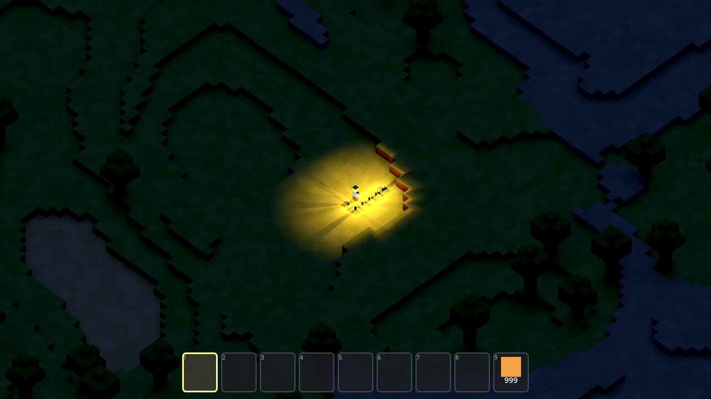
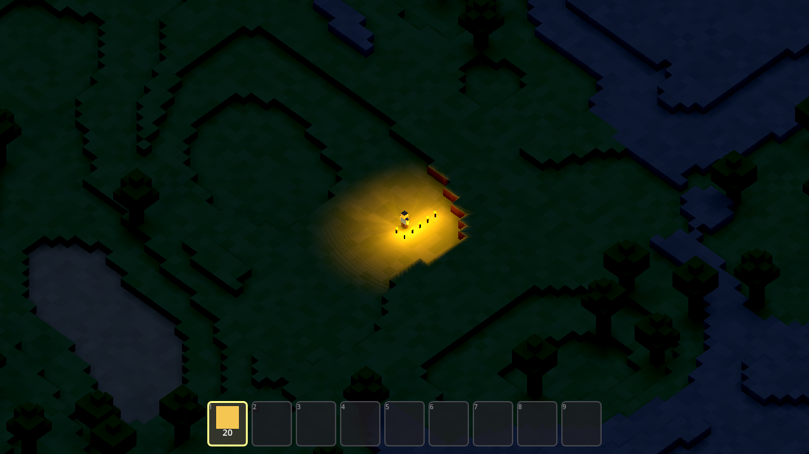
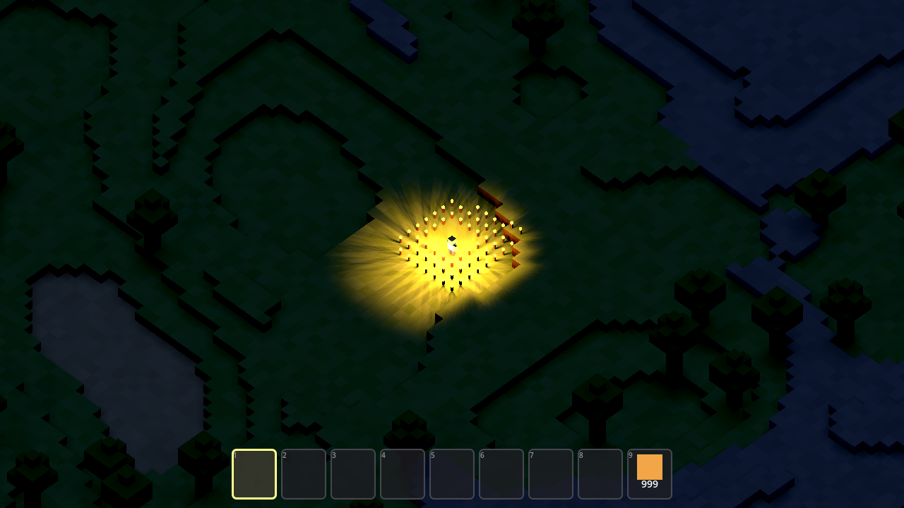
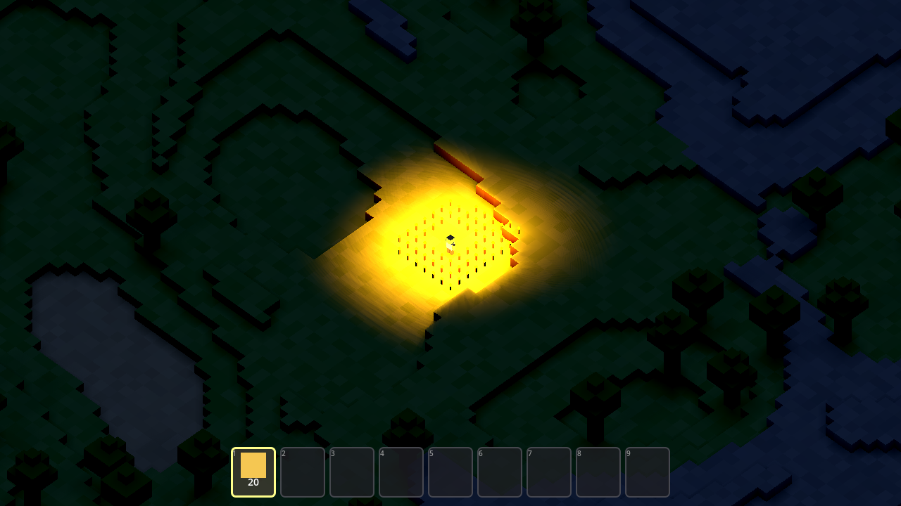

# Wildes — Task 003: Torches and Casted Shadows

<!-- Task overview. See instruction.md for the full spec. -->

This task moves the Wildes voxel sandbox off the **`gl_compatibility`** renderer and onto
**`forward_plus`** (so the world can carry many light-emitting objects at once), color-grades the
result back to the original high-key look (Environment **tonemap Linear**, exposure `1.0`,
adjustments on, **contrast `1.3`**, **saturation `1.2`**; terrain shader **saturation `1.1`**,
**contrast `1.3`** with a luminance-mix + clamp so nothing blows out), switches the directional
sun/moon shadow to **`SHADOW_ORTHOGONAL`**, and adds a new **walk-through "Torch" block** that
**lights a 9-block radius and casts soft shadows on blocks and the player**. Because a player can
place **arbitrarily many torches** in view, torch visuals and storage must stay **cheap**. **"Done"**
= the game runs headless with **no errors or warnings**, and **no features beyond the spec** are added.

Two agents implemented the same `instruction.md` independently — **Avocado (Muse Spark)** and
**Claude Opus 4.8** — each starting from the **Task-002 golden source** (the committed day/night
cycle, baseline `899f8ff`), and this task compares them (see _Trajectories_ below). This comparison
is drawn from the two run transcripts, the two working source trees, and the
[`./screenshots/`](./screenshots) I captured by launching **both** projects in Godot 4.7
(`4.7.stable`, Metal **Forward+**, Apple M4 Pro) through a throwaway autoload harness that set the
time of day, placed matched torch clusters, and saved the viewport at two night states: **a small
torch cluster** and **a 60-torch field**. (The author's
golden torch solution exists as a paste and a gameplay video — see below — but is intentionally
**not** used as a comparison baseline; the shared gold `src/` committed in the repo is still the
Task-002 source, so the head-to-head is strictly Avocado vs Claude.)

Both delivered a working torch pass on the same foundation: both switch the renderer to
**`forward_plus`**, both apply the spec's color-grade values **exactly** (env saturation `1.2` /
contrast `1.3`; terrain `terrain_saturation 1.1` / `terrain_contrast 1.3`, the luminance vector
`vec3(0.21, 0.72, 0.072)`, and **both** clamps), both set the directional shadow to
**`SHADOW_ORTHOGONAL`**, both add a walk-through **`TORCH`** block (enum value `6`) whose light
uses a **9.0** range and **cube shadows**, both wire it into the hotbar, both run Godot 4.7
**headless clean with no errors or warnings**, and **neither exported a build**. Both also keep the
spec's stated target — **torch visuals and storage** — cheap. Where they diverge is a genuine
**performance-vs-lighting-fidelity tradeoff** in how the torch *light* scales, and — for the first
time in this series — on a shared *weakness*: **neither agent rendered a single frame.**

## Observations

### The headline change from the previous task

For Tasks 000–002 the story was always the **render-path check**: Claude looked at the rendered
pixels and Avocado didn't, and that gap is what let real visual defects through. **This task breaks
that pattern — from the other side.** Given the same Task-002 base, **neither agent rendered a
frame**: both verified **headless only**. So the differentiator that separated them for three tasks
running **collapses here — both fail the render bar equally.** What separates them now is
**torch-light architecture** — and it's a genuine tradeoff, not a clean win. The spec's cheapness
clause targets *"torch visuals and storage"*, and **both satisfy it** (shared meshes/materials +
lightweight dictionary storage). The two differ on how the *light* scales: Claude uses **two
MultiMeshes plus a fixed pool of 12 shadow-casting lights** reassigned to the nearest torches — so
total light/shadow cost stays **flat**, but in a dense field the torches outside that pool **don't
illuminate their 9-block radius**. Avocado gives **every torch its own shadow-casting light** — so
each torch always lights its radius, but light/shadow cost **grows with the count**.
Bounded-but-partial vs faithful-but-costly. I rendered both myself for this write-up, and the
tradeoff is visible the moment you place a crowd of torches (see _Visual comparison_).

### Process (how the work got verified)

| Evaluation | Claude (Opus 4.8) | Avocado (Muse Spark) | Track opportunity |
| --- | --- | --- | --- |
| **Engine in the loop** | Ran Godot 4.7 **headless** ~7–8× (`--headless --quit-after N`). Pass curve **PASS · PASS · FAIL · PASS · PASS · PASS · PASS** — one real parse-error failure, diagnosed and fixed. Located Godot at `/Applications/Godot.app`, confirmed `4.7.stable`. Final runs clean, no warnings. | Ran Godot 4.7 **headless** ~7× (`--headless --path . --quit`). **Clean from the first run and stayed clean.** Same Godot bundle, confirmed `4.7.stable`. Final `--verbose \| grep error\|warning` empty. | Both clear the headless bar; **this task neither clears the render bar** — see below. |
| **Durability of the tests** | No committed suite (project ships none). Wrote a **throwaway** `_torch_test.gd` (~39-line `SceneTree` driver) asserting place/mine/pool behavior (24 placed, 1 mined → type 6, exactly **12** pooled lights), ran it, then **`rm -f`**'d it. | No committed suite. Wrote **two** throwaway `SceneTree` scripts (`test_torch.gd`, `test_torch2.gd`) — placed **97** torches, checked walk-through/state — then **`rm`**'d them in the same command. | Neither shipped a durable, re-runnable check — the slot is still open. |
| **Render-path check** | **None.** Verified via headless logs + the functional driver only; it **explicitly offered** a screenshot at the end ("that requires a non-headless run") but never took one. | **None.** Headless only — every visual criterion (torch glow, soft shadows, color-grade result, "no blown-out colors") was **reasoned about, never seen**. | **The biggest open opportunity this task:** the render bar is now **unmet by both**, and the visible night differences below went unseen by either agent. |
| **Debugging under failure** | Hit a **real cascading bug**: `var lit := min(candidates.size(), MAX_TORCH_LIGHTS)` — `min()` returns Variant, which the project treats as a **parse error**, which detached `world_generator.gd` and surfaced a **red-herring** `Nonexistent function 'is_solid' in base 'Nil'`. It **did not chase the symptom** — re-ran with `--quit-after 5`, read the real error at the top, and fixed it with an explicit `var lit: int = …`. | Run was clean; its one wobble was **self-caught, non-visual**: the `renderer/rendering_method` line went **missing** after an edit; it caught this on a final `grep renderer` self-audit and **re-added it explicitly**. A no-op `main.tscn` shadow edit ("oldString and newString are identical") was correctly skipped. | Reward reading the **real root error past the red herring** (Claude) — while crediting Avocado's clean run and self-audit. |
| **Speed** | **~12m30s** (harness footer "Brewed for 12m 30s"; consistent with edit mtimes 16:52–17:00). | **~5m2s** wall-clock (real session timestamps `4:27:27 → 4:32:29 PM`). | The faster run took the **simpler per-torch** design and skipped the pooling/culling machinery — a fair chunk of Claude's extra time. Speed here tracks how much light-scaling logic each chose to build. |

### Implementation & architecture (from the source + transcripts)

Both inherit the Task-002 foundation (day/night cycle, lit terrain, baked AO) **unchanged** and
concentrate the new work in `world_generator.gd`. From there they diverge on **how a torch is
represented, how its light scales, and whether the renderer switch survived in the file.**

| Aspect | Claude (Opus 4.8) | Avocado (Muse Spark) |
| --- | --- | --- |
| This task's work | **~200 lines added / 6 removed across 8 files**; `world_generator.gd` **+162 / −2** (the whole torch subsystem), thin touch-points elsewhere | **~175 net new across 7 files**; `world_generator.gd` **+142** (torch subsystem), thin touch-points elsewhere |
| Renderer switch | Edited `project.godot` to `forward_plus`, but Godot **re-serialized the file and stripped the line** (it's the desktop default) — final file has **no explicit `rendering_method`**; also fixed the `main.gd` startup log `"…Compatibility"` → **`"…Forward+"`** | Set `rendering_method="forward_plus"` **explicitly (line kept)**; left the `main.gd` startup log reading **`"…Compatibility"`** (now stale/misleading) |
| Color grading | **Exact spec values**, and additionally **pushes the uniforms from GDScript** (`_prepare_materials`: `terrain_saturation 1.1`, `terrain_contrast 1.3`) rather than relying on shader defaults | **Exact spec values**; relies on the shader-side **uniform defaults** (not driven from GDScript) |
| Directional shadow | `sun_light.directional_shadow_mode` → **`SHADOW_ORTHOGONAL`** (the single sun/moon caster) | Sun **and** fill light → **`SHADOW_ORTHOGONAL`**; also bumped `directional_shadow_max_distance` **220 → 360** (unrequested) |
| Torch representation | **Not stored in the voxel terrain at all** — a `torch_blocks` `Dictionary` (`Vector3i → true`), so torches are **inherently walk-through and cheap**; `is_solid()` is untouched | `torch_lights` + `torch_visuals` `Dictionary`s under a `TorchContainer`; makes `is_solid()` return **false** for `TORCH` and adds helpers `is_collider_solid` / `is_raycast_solid` / `is_torch` |
| Torch visuals | **Two `MultiMesh`es** (stick + flame) → **2 draw calls total, regardless of torch count** | Per-torch **`Node3D` with two `MeshInstance3D`** (stick + flame), sharing two `BoxMesh` + two `StandardMaterial3D` resources → **2 mesh instances per torch** |
| Torch lighting (design tradeoff) | A **fixed pool of `MAX_TORCH_LIGHTS = 12`** `OmniLight3D` (range **9.0**, energy **3.0**, `SHADOW_CUBE`), **reassigned every 0.2s to the nearest torches**, cull distance **48** → total light/shadow cost **stays flat**, but only the **nearest 12** torches cast light — extras in a dense field go dark | **One `OmniLight3D` per torch** (range **9.0**, energy **1.8**, `SHADOW_CUBE` each) → **every torch always lights its 9-block radius**, but light + shadow cost **grows with each torch placed** (no pool/cull/cap) |
| Visuals + storage cost (the spec's cheapness ask) | **Cheap** — 2 draw calls (MultiMesh) + a `Vector3i → true` set; the only non-constant bits are an O(n) nearest-torch scan every 0.2s and a multimesh rebuild on edit | **Cheap** — shared `BoxMesh`/material resources + two dictionaries; 2 mesh instances per torch but **no per-torch resource duplication** |
| Hotbar / usability | Player starts with **slot 9 = 999 torches** (torches don't occur naturally) | Player starts with **slot 1 = 20 torches** (a small unrequested convenience) |
| Minor issues | `project.godot` carries **no explicit renderer line** (relies on the `forward_plus` default) — works headless, but fragile as documentation-of-intent / for a non-desktop export; and the 12-light pool means **distant torches in a crowd don't light their radius** | **Stale `"Compatibility"` startup log**; unrequested `max_distance` bump; per-torch cube shadows mean **light/shadow cost climbs with the torch count** |

The Task-001/002 pattern shifts. There the split was *render vs no-render* and Claude won on looking;
here **both** skip the render, so that axis is a wash. What's left is a real engineering **tradeoff**:
Claude wrote **more** code for the more sophisticated design (MultiMesh + a bounded 12-light pool) and
read its real bug past a misleading symptom — but its pooling leaves distant torches unlit under
crowding; Avocado wrote **less** code, ran clean on the first try, and keeps every torch lighting its
radius — but pays a light/shadow cost that grows with the count. **Neither choice is strictly the
spec's**: the explicit cheapness ask (visuals + storage) is met by both.

### Visual comparison (from `./screenshots/`)

Both projects generate the **identical** world (`seed 1337`) from the **identical** spawn, so these
frames are directly comparable — terrain, trees, sand pond, and stone ridge line up exactly, and the
torch clusters were placed at matched positions around the player. Both were captured by launching
each workspace in Godot 4.7 on the Forward+ renderer via a throwaway autoload harness (not committed;
neither agent rendered any of these — **I did**, for this comparison).

| State | Claude (Opus 4.8) | Avocado (Muse Spark) |
| --- | --- | --- |
| **Night — small torch cluster** | **Brighter, punchier** warm pool (light energy `3.0`): dramatic radiating light rays and **sharp, clearly-cast block shadows**; terrain elsewhere stays cool-blue and playable | **Softer / dimmer** warm pool (energy `1.8`): gentler glow and **softer shadows**; also lights + casts, just lower-key |
| **Night — 60-torch field** | Glow stays **bounded** — only the **nearest 12** torches are lit, so a dense crowd produces a bright but **contained** pool that barely grows past the small-cluster size; the outer torches sit **unlit** (the pool cap holding cost flat) | Glow **balloons** into a large, near-**blown-out** yellow field because **every one of the 60 torches emits** — visually fuller and each torch lights its radius, at the light/shadow cost that grows with the count |

Both apply the exact color-grade values, so the daytime look is unchanged by the renderer switch
(verified in source; not shown here). The divergence is at night, and it is the tradeoff made
visible: Claude's torch light is **capped by
its 12-light pool**, so a 60-torch crowd looks much like a 6-torch cluster (cost stays flat, but the
outer torches sit dark); Avocado lights **every** torch, so the same crowd blossoms into a big,
brighter, near-clipping glow — fuller and radius-faithful, at a light/shadow cost that scales with the
count. Two honest ends of the same tradeoff — and **neither agent saw either**: both shipped the
night look **unrendered**.

### Bottom line

Given the same Task-002 base, both agents produced a working torch pass: renderer on
**`forward_plus`**, the spec's **exact** color-grade values, **`SHADOW_ORTHOGONAL`** shadows, a
**walk-through 9-radius torch** that casts cube shadows on blocks and the player, **cheap torch
visuals + storage** (the spec's explicit ask), hotbar integration, and a **headless-clean** run with
no errors or warnings — and **neither exported a build**. The real divergence is a genuine
**performance-vs-fidelity tradeoff** in the torch light. Claude built the more sophisticated system —
**two MultiMeshes + a bounded 12-light pool** so total cost stays flat — and debugged the better,
reading a **real parse error past a red-herring symptom** and fixing the stale renderer log; the
price is that under a dense crowd only the nearest 12 torches light their radius. Avocado was
**~2.5× faster**, clean on the first run, and keeps **every torch lit** (radius-faithful), but its
per-torch shadow-casting lights make cost climb with the count, and it left a stale `"Compatibility"`
log and an unrequested `max_distance` bump. Neither is strictly "correct" — they sit at opposite
ends of the same tradeoff. And for the first time in this series the two share a **weakness**:
**neither rendered a frame**, so the visible night differences above were invisible to both. The open
track opportunity is now sharpest on process: keep rewarding autonomous engine-in-the-loop
verification that **inspects rendered output** — this task shows *both* agents skipping it — and
reward surfacing the light-scaling tradeoff **explicitly** (bounded-but-partial vs faithful-but-costly)
rather than defaulting to either extreme.

## Videos

Gameplay recordings (uploaded to PixelCloud — do not commit video files):

- **Golden solution (author reference):** [pxl.cl/bSNr3](https://pxl.cl/bSNr3) — gameplay of the shipped reference build.

## Trajectories

Agent run logs:

- **Avocado (Muse Spark):** [P2436711579](https://www.internalfb.com/phabricator/paste/view/P2436711579) — ran Godot **headless only** (~7 runs, **clean from the first**); set `forward_plus` explicitly; **one shadow-casting `OmniLight3D` per torch** (no pool/cull/cap); torches walk-through via `is_solid=false` + helpers; self-caught a dropped renderer line via `grep`; ~5m2s; **never rendered a pixel**; every torch lights its radius, but light/shadow cost grows with the count.
- **Claude (Opus 4.8):** [P2436712579](https://www.internalfb.com/phabricator/paste/view/P2436712579) — ran Godot **headless only** (~7–8 runs, curve PASS·PASS·**FAIL**·PASS…); torch subsystem in `world_generator.gd` (+162) — **2 MultiMeshes + a bounded 12-light pool** with cull distance 48; read a real `min()`→Variant parse error past a red-herring `is_solid` symptom; wrote and deleted a `_torch_test.gd` driver; ~12m30s; **never rendered a pixel**; cost stays flat but distant torches in a crowd go unlit.
- **Golden (author reference):** [P2436710585](https://www.internalfb.com/phabricator/paste/view/P2436710585) — reference; not compared.

## Artifacts

- Screenshots: [`./screenshots/`](./screenshots) — `avocado/` and `claude/`, each with `night_torches.png` (small torch cluster) and `many_torches.png` (60-torch field). All captured by launching each workspace in Godot 4.7 (`4.7.stable`) on the **Forward+** renderer via a throwaway autoload harness that set the time of day, placed matched torch clusters, and saved the viewport; the harness was not committed. **Neither agent rendered any frames in its trajectory — these were rendered by the author** for this comparison.
- Binaries: none. **Neither agent exported a build in its trajectory** (no `--export` step in either transcript, and no build artifact in either workspace). Run from source — `godot --path src` (or open `src/` in the Godot 4.7 editor and press Play).
