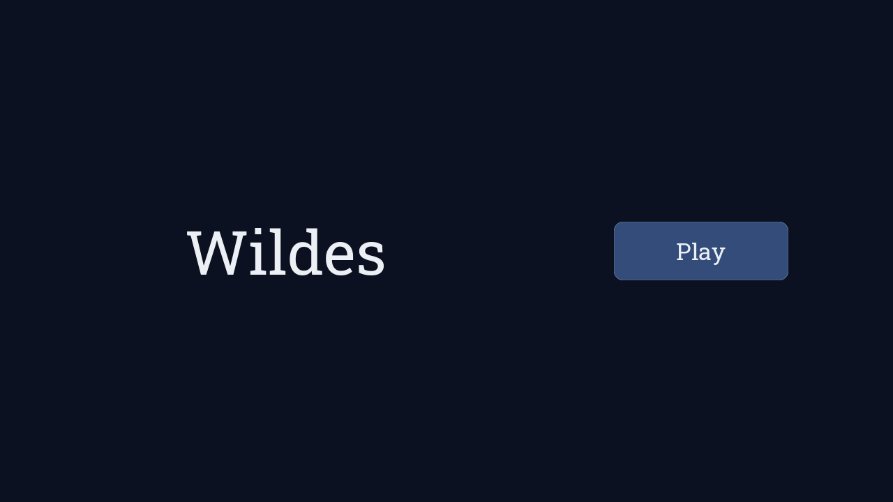
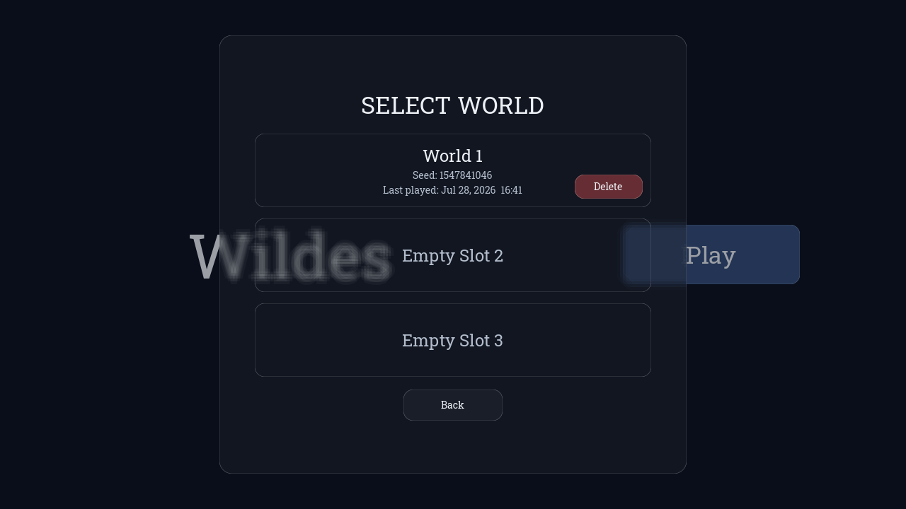
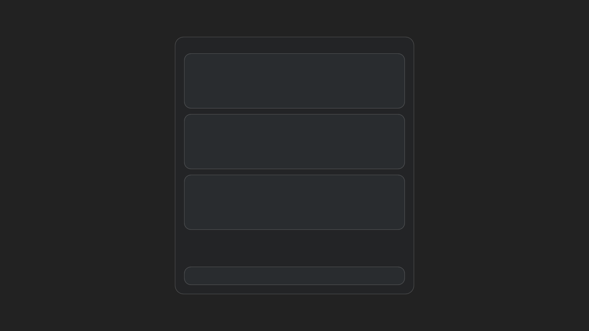
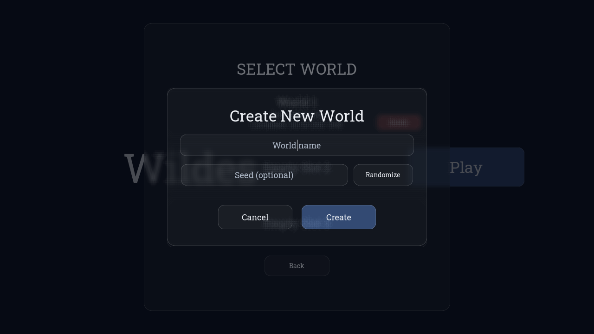
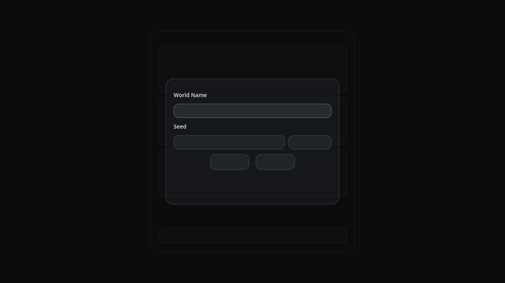
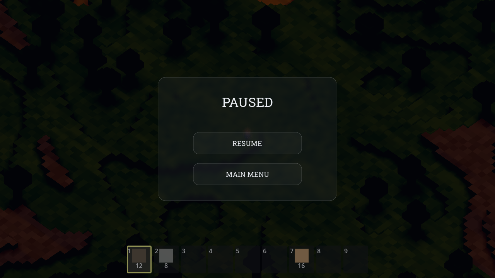
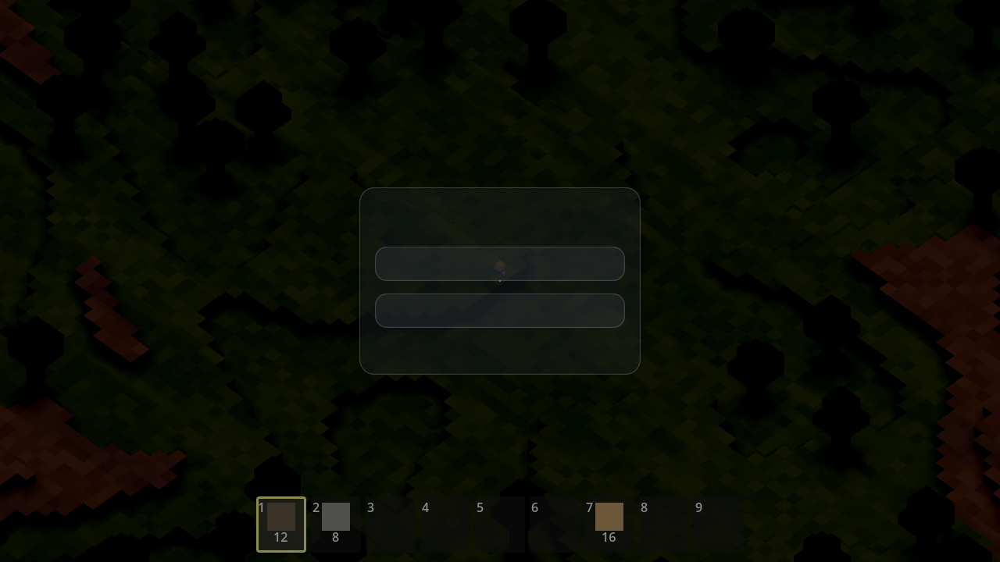

# Wildes — Task 004: User Interface and Saves

<!-- Task overview. See instruction.md for the full spec. -->

This task adds the **whole front-end and persistence layer** to the Wildes voxel
sandbox, on top of the Task-003 source (the modular refactor that split the gold
`src/` into feature modules). It requires a **frosted/blur ("frosted glass")
material on ALL UI**, built from a custom shader, plus a **Roboto Slab** font, and
a set of screens with exact colors: a **Main Menu** (title left, medium Play
button right, deep-navy bg), a **World Select** modal with **3 save slots**
(showing world name, seed, and last-played for saved worlds; a **Delete** button
per saved slot), a **Create World** modal (name field, seed field, **Randomize**),
a **Delete World** modal with a **hold-to-delete: hold 3.0 s** while a progress bar
fills and the button reads **"HOLDING... X.X/3s"**, a **World Generation** loading
screen with a **"Chunks: X/Y"** progress readout, and a **Pause** modal (`esc`;
**Resume** / **Main Menu**) that **freezes ALL game state and timers**. The **save
system** persists up to **3 worlds** — world (seed + block edits), character
position, timers, and world time — so the World Select slots round-trip. **"Done"**
= the game runs headless, and the three scripted acceptance UI flows work.

Two agents implemented the same `instruction.md` independently — **Avocado
(avocado-code-latest)** and **Claude Opus 4.8** — each starting from the same
committed Task-003 foundation, and this task compares them (see _Trajectories_
below). This comparison is drawn from the two run transcripts, the two working
source trees, and the [`./screenshots/`](./screenshots) I captured by launching
**both** one-shots in Godot 4.7 (`4.7.stable`) on the OpenGL (Compatibility)
driver via a throwaway autoload harness that drove each front-end to matched
states (main menu, world select, create world, and pause over a live seed-4242
world) and saved the viewport; the harness was **not** committed. (The author's
gold solution — built with Avocado across two sessions, see _Trajectories_ — and
its gameplay video are the reference; the gold is intentionally **not** used as a
comparison baseline. The head-to-head is strictly the two one-shots.)

Both delivered a spec-shaped result and both got the **logic** right: a full
screen state machine (Main Menu → World Select → Create/Delete → Loading →
Playing → Pause), a **3-slot** save system that round-trips seed + block edits +
player position + world time to `user://`, a pause that freezes everything via
`get_tree().paused` with overlays on `PROCESS_MODE_ALWAYS`, a working seed
Randomize, a hold-to-delete timer that reads exactly `"HOLDING... X.X/3s"`, and
**modal/button colors and radii that match the spec constants exactly**
(`Color(0.14,0.16,0.18,0.32)` / radius 18; `Color(0.20,0.22,0.24,0.38)` /
radius 14). Both ran Godot 4.7 headless and both **hit the same corrupt-font
trap** while fetching Roboto Slab. But the real difference is the same one that
separated the last task — **did the agent look at the rendered result** — and this
time it decided two of the spec's core visual requirements.

## Observations

### The headline change from the previous task

Last task the split was subtle (a blown-out noon only a rendered frame would
catch). This task it is **stark**: the Avocado one-shot **ships two of the spec's
headline visual requirements broken**, and neither is visible from a headless log.
(1) The **frosted-glass shader** is written against `SCREEN_TEXTURE` — a Godot-3
builtin **removed in Godot 4** — with no `BackBufferCopy` and no
`hint_screen_texture` uniform, so it fails to compile and every panel falls back
to a flat `StyleBoxFlat` tint with **no blur**. (2) The **Roboto Slab `.ttf`
files are not fonts** — they are GitHub **404 HTML pages** (all four downloads came
back at an identical ~318 KB; the agent checked `ls -lh` size but never the bytes),
so FreeType fails at load and **all themed UI text renders blank**. Both agents
actually **hit the same font trap** — but Claude **rendered the menus, saw blank
text, ran `file *.ttf`, re-downloaded the genuine Apache-2.0 variable font, and
fixed it**; Avocado ran only headless, "fixed" the FreeType errors by *silencing
the font loads in headless mode*, and shipped the corrupt files. Same story for
the blur: Claude's samples `hint_screen_texture` behind a `BackBufferCopy` in all
six UI scenes and it **visibly blurs the world**; Avocado's never rendered, so its
dead shader shipped. Under the hood **both state machines and save systems are
sound** — the divergence is entirely on the render-path.

### Process (how the work got verified)

| Evaluation | Claude (Opus 4.8) | Avocado (avocado-code-latest) | Track opportunity |
| --- | --- | --- | --- |
| **Engine in the loop** | Godot 4.7 **headless AND windowed**. Found Godot at `/Applications/Godot.app`, confirmed `4.7.stable`. Headless import + logic suites, **plus a windowed `opengl3` run that captured 7 PNGs it then `Read`**. Curve: 2 parse errors → fixed → clean; **36/36** logic + **30/30** flow asserts + clean boot. **Final: PASS.** | Godot 4.7 **headless only** (~18 invocations: imports, boots, `--script` test runs, one throwaway theme-gen script). **No windowed run, no screenshots.** Curve: `.tscn`/`.gd` parse errors → fixed; a real seed bug → fixed; final flow test **4/4 PASS**, exit 0. **Final: PASS (headless).** | Reward autonomous engine-in-the-loop verification that **renders and inspects** UI — both clear the headless bar; only one clears the render bar. |
| **Durability of the tests** | **Committed suite: `test_saves.gd` (244 LOC, 36 asserts) + `flow_test.gd` (193 LOC, 30 asserts) + `tests/README.md`.** Covers a real **save→load round-trip** (blocks, player pos, camera, inventory, world time), terrain determinism, and the **3 acceptance flows** incl. hold-to-delete (1 s does *not* delete, 3.1 s does). | **Committed suite: `test_flows.gd` (98 LOC, ~4 asserts).** Maps to the 3 flows but drives them through **direct `GameManager` method calls**, and every saved file has **empty block arrays** — so the block round-trip is asserted only structurally, never with data. | Reward durable tests that exercise **real widget input + data round-trips**, not just method calls on empty state. |
| **Render-path check** | **Yes — rendered and looked, extensively.** 7 screenshots (`01_main_menu`…`07_pause`) captured and inspected; **visual inspection caught two real layout bugs** (a per-card Delete button flying off-screen; a mis-centered loading panel) that headless missed — both fixed and re-shot. | **None.** Headless only — it **never saw a rendered frame**. Every visual requirement (blur, fonts, layout, progress bar) was reasoned about, never pixel-verified. | Reward verification that inspects **rendered output** — exactly where both defects here hide. |
| **Asset integrity** | Detected the corrupt HTML "fonts" (`file *.ttf`), **re-downloaded the real 251 KB Apache-2.0 variable font**, switched to `FontVariation` weights. Verified real TrueType. | **Shipped corrupt fonts.** Mis-read the FreeType errors as a headless limitation and wrapped font loads in a `DisplayServer != "headless"` guard — silencing the symptom, leaving four 318 KB HTML files in `assets/fonts/`. | Reward validating **downloaded asset bytes** (magic/`file`), not just that a file of some size exists. |
| **Debugging under failure** | Bugs were **visual, found by looking, fixed in code**: blank text → font bytes; two anchor/position layout conflicts → absolute positioning. | Bug was **real and non-visual, found + fixed**: a **seed-timing bug** — `setup_for_new_world` used an `@onready` `world` that was **null before `add_child`**, so every world used the default seed 1337; fixed to `get_node_or_null("World")` and set the seed pre-`add_child`. Confirmed seed 4242 post-fix. | Reward both: render-only defect-finding **and** headless root-causing of a state/timing bug. |
| **Speed** | **~40m50s** (transcript footer "Crunched for 40m 50s"; src mtimes 12:07→12:40 consistent). | **~23m17s** (real header timestamps 11:53:22 → 12:16:39). | The faster run was faster largely because it **skipped the render check** — and that is exactly what let the blur + font defects through. |

### Implementation & architecture (from the source + transcripts)

Both inherit the Task-003 modular `src/` unchanged and add a menu layer + a save
system + a pause flow. They diverge on **how the front-end is structured**, on the
**save format**, on **test depth**, and — decisively — on whether the visual layer
was ever rendered.

| Aspect | Claude (Opus 4.8) | Avocado (avocado-code-latest) |
| --- | --- | --- |
| This task's new code | **~1,679 LOC across 15 new `.gd` + 1 `.gdshader`** (largest: `test_saves.gd` 244, `flow_test.gd` 193, `delete_world_modal.gd` 148, `world_select_modal.gd` 143) + a real font + `tests/README.md` | **~2,035 LOC across 13 new `.gd` + 1 `.gdshader`** (largest: `game_manager.gd` **444**, `world_save_manager.gd` 324, `create_world_modal.gd` 188, `delete_world_modal.gd` 187) |
| Front-end architecture | **Distributed**: a thin **74-line `game_session.gd` autoload** carries cross-scene state; `main_menu.gd` orchestrates the menu modals; `game.gd` owns Loading→Playing→Pause; navigation via `change_scene_to_file` | **Centralized**: one **444-line `game_manager.gd`** state machine (7-state enum) drives **6 `CanvasLayer`s** (layers 0/10/20/30/40/50); the game is instanced into a `GameContainer` under the same root |
| Frosted-glass shader | **Real screen-space blur.** `frosted_glass.gdshader` samples `hint_screen_texture`; **every one of the 6 UI scenes adds a `BackBufferCopy`** before its glass panel; **13-tap dual-ring box blur** (`blur_radius = 4.0 px`) + rounded-rect SDF mask. **Visibly blurs the content behind (confirmed).** | **Dead shader.** `ui_frosted.gdshader` does a genuine 5×5 blur design **but samples `SCREEN_TEXTURE`** (removed in Godot 4) with **no `BackBufferCopy` / `hint_screen_texture`** → compile error → **flat `StyleBoxFlat` fallback, no blur** (confirmed) |
| Fonts | **Real Roboto Slab** — verified 251 KB TrueType, Apache-2.0 `LICENSE.txt`, weights via `FontVariation`. Text renders. | **Corrupt** — `RobotoSlab-*.ttf` are GitHub 404 HTML (~318 KB each) → FreeType fails → **themed text renders blank** (a few plain fallback-font labels survive) |
| Save format | **Binary** `FileAccess.store_var(…, true)` at `user://saves/world_{slot}.save`, `SAVE_VERSION=1` — chosen so `Vector3i`-keyed block dicts round-trip. Stores name/seed/timestamps, **world delta** (`voxel_world.to_save_dict()`), player pos+velocity, **camera yaw+ortho size**, inventory, and `clock.time_of_day` | **JSON** — two files per slot (`metadata.json` + `world.json`) at `user://worlds/slot_{0..2}`. Stores seed, name, player position, `time_of_day`, `play_time` + a `timers` dict, `placed`/`removed`/`torch` arrays, full inventory; load re-hydrates with `int()` casts to fix JSON float coercion |
| Committed tests | **66 asserts** across two files (`test_saves` + `flow_test`) **+ README**; real block/pos/camera/inventory/world-time round-trip; hold-to-delete timing | **~4 asserts** in one 98-LOC file; flows via direct method calls; **block round-trip untested with data** |
| Delete "hold-to-delete" | `HOLD_SECONDS=3.0`; `_process` fills a bar, label `"HOLDING... %.1f/%ds"` → **"HOLDING... X.X/3s"** ✔; verbatim spec description | `HOLD_DURATION=3.0`; hidden `ProgressBar` (0→3) reveals + fills; label `"HOLDING... %.1f/3s"` ✔; verbatim spec description |
| Loading screen | `"WILDES"` + `"Loading World"` + bar + `"Chunks: %d/%d"` fed by `WorldController.generation_progress` (chunked over frames) | `"WILDES"` (48 pt) + bar + `"Chunks: %d/%d"` fed by `generate_all_chunks_async()` (100 chunks, batched) |
| Pause / freeze | `get_tree().paused=true` + `_open_pause`; overlays `PROCESS_MODE_ALWAYS`; `game_clock` also guards `not paused`. Correct. | `get_tree().paused=true` in `_on_game_paused`; pause layer `PROCESS_MODE_ALWAYS`; base clock already gates on `not paused`. Correct. |
| "Timers" vs "World Time" | Game has no discrete `Timer` nodes; both map to the day/night clock (`time_of_day`), which is persisted + frozen — slightly conflates two spec bullets | Persists an explicit `timers` dict **and** `time_of_day`/`play_time` separately |
| Build/binary | **None** — no `--export` in the trajectory | **None** — no `--export` in the trajectory |

The pattern flips on code volume: this time **Avocado wrote more code (2,035 vs
1,679)** and a larger central orchestrator, and did the harder *headless*
debugging (the null-`world` seed-timing bug). **Claude wrote less, spread it into
small single-responsibility files + an autoload, invested far more in the
committed test suite, and — decisively — rendered the UI and fixed what it saw.**

### Visual comparison (from `./screenshots/`)

Both one-shots were launched in Godot 4.7 on the OpenGL (Compatibility) driver and
driven to the same four states; the pause frames use the **same seed 4242**, so the
terrain behind them is directly comparable. The difference is immediate and total.

| State | Claude (Opus 4.8) | Avocado (avocado-code-latest) |
| --- | --- | --- |
| **Main menu** | **"Wildes"** in rendered Roboto Slab on the left, an accent **"Play"** button on the right, deep-navy bg — exactly the spec diagram | A single flat rounded button and **no text at all** — no title, no "Play" (corrupt font → everything blank) |
| **World select** | **"SELECT WORLD"**, a saved **"World 1"** card (name, `Seed: …`, `Last played: …`) with a red **Delete**, plus **Empty Slot 2/3** and **Back** — and the main menu is **visibly blurred through the glass** | Panel + 3 slot cards + a bottom button as **flat grey boxes with all text blank**; no blur (nothing is frosted) |
| **Create world** | **"Create New World"**, a **World name** field, a **Seed (optional)** field + **Randomize**, and **Cancel/Create** — rendered over a **layered frosted blur** of the world-select and menu behind | Fields and buttons present; only the plain **"World Name"/"Seed"** fallback-font labels render — modal title and all buttons are **blank**; panels are flat, unblurred |
| **Pause** | **"PAUSED / RESUME / MAIN MENU"** rendered, and the live voxel world behind the panel is **clearly blurred** (soft inside the panel, sharp outside) | Buttons are **blank** (only the inherited hotbar numbers, which use Godot's default font, show); the terrain stays **sharp through the flat panel** — the shader is dead |

Both frames of every pair render the **same layout geometry** — the panels, cards,
and buttons are positioned almost identically, because both agents built the same
spec structure with the same exact colors and radii. What separates them is
**everything that only exists once rendered**: Claude's frosted glass genuinely
blurs the backdrop and its Roboto Slab text is legible; Avocado's panels are flat,
unblurred boxes and its themed text is simply gone. Avocado's own transcript notes
it was unsure whether the shader would work and hoped it "should" — it did not, and
nothing in its headless-only loop could tell it so.

### Bottom line

Both agents produced a structurally complete UI + saves layer: the same 7-state
front-end, a 3-slot save system that round-trips seed + block edits + player state
+ world time, a correct `get_tree().paused` freeze, a spec-exact hold-to-delete,
and modal/button colors and radii that match the spec constants to the digit. From
there Claude is the stronger one-shot on the axes that decide this task: it **wrote
a real frosted-glass shader** (`hint_screen_texture` + `BackBufferCopy`) that
visibly blurs, **shipped a working Roboto Slab font** (catching the same corrupt
download Avocado missed), invested in a **66-assert committed suite** with a genuine
save round-trip, and — the throughline for three tasks running — **rendered the UI,
inspected it, and fixed the two layout bugs it saw**. Avocado was **~1.8× faster**,
wrote more code, and did the harder headless root-cause (the null-`world` seed
bug), but it **never rendered a frame** and so shipped **two broken headline visual
requirements** — a dead blur shader and blank UI text — that a single screenshot
would have exposed. The open track opportunity is unchanged and now four-for-four:
reward autonomous **engine-in-the-loop verification that renders and inspects UI**,
reward **asset-integrity checks** (validate downloaded bytes, not just file size),
and reward **durable tests that exercise real input and data round-trips** over raw
code volume and speed.

## Videos

Gameplay recordings (uploaded to PixelCloud — do not commit video files):

- **Golden solution (author reference):** [pxl.cl/bVn9B](https://pxl.cl/bVn9B) — gameplay of the shipped reference build (menus, world create/load, saves, pause).

## Trajectories

Agent run logs:

- **Avocado one-shot (avocado-code-latest):** [P2438477184](https://www.internalfb.com/intern/everpaste/?phabricator_paste_number=2438477184) — Godot 4.7 **headless only** (~23m17s); one 444-line `game_manager.gd` state machine; found + fixed a real null-`world` seed-timing bug; **never rendered a pixel** → shipped a dead `SCREEN_TEXTURE` blur shader and corrupt HTML "fonts" (blank UI text).
- **Claude one-shot (Opus 4.8):** compared from its local run transcript (not linked) — Godot 4.7 **headless + windowed**; rendered and **inspected 7 screenshots**, catching + fixing 2 layout bugs and the corrupt-font trap; real `hint_screen_texture`+`BackBufferCopy` frosted glass; 66-assert committed test suite with a real save round-trip; ~40m50s.
- **Golden (author reference, Avocado — built across two sessions):** [P2438476566](https://www.internalfb.com/phabricator/paste/view/P2438476566) (session 1) · [everpaste 2438475664](https://www.internalfb.com/intern/everpaste/?phabricator_paste_number=2438475664) (session 2) — reference; **not** used as a comparison baseline.

## Artifacts

- Screenshots: [`./screenshots/`](./screenshots) — `avocado/` and `claude/`, each with `01_main_menu.png`, `02_world_select.png`, `03_create_world.png`, and `04_pause.png`. All captured by launching each one-shot in Godot 4.7 (`4.7.stable`) on the OpenGL (Compatibility) driver via a throwaway autoload harness that drove the front-end to each state (pause over the same seed-4242 world) and saved the viewport; the harness was **not** committed. (Claude rendered and inspected its own frames in-trajectory; Avocado never rendered any — these Avocado frames were captured here for the comparison and show the shipped blur/font defects.)
- Binaries: none. **Neither one-shot exported a build** (no `--export` step in either transcript). The macOS review build is produced by the repo's `build-macos-release` GitHub Action from the committed gold `commit-hash`; run from source meanwhile with `godot --path src` (or open `src/` in the Godot 4.7 editor and press Play).
