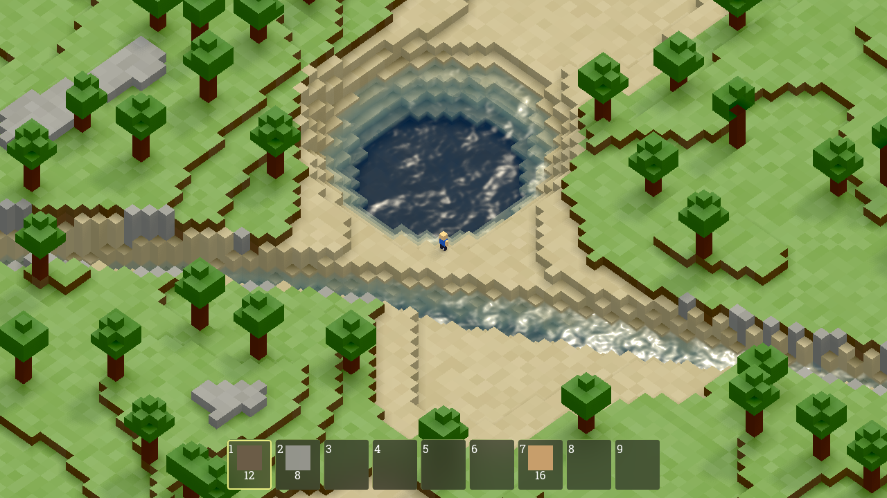
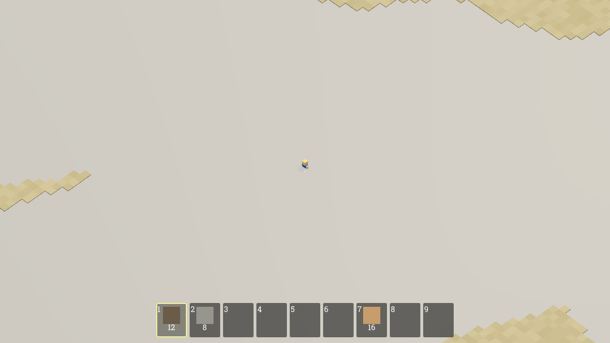
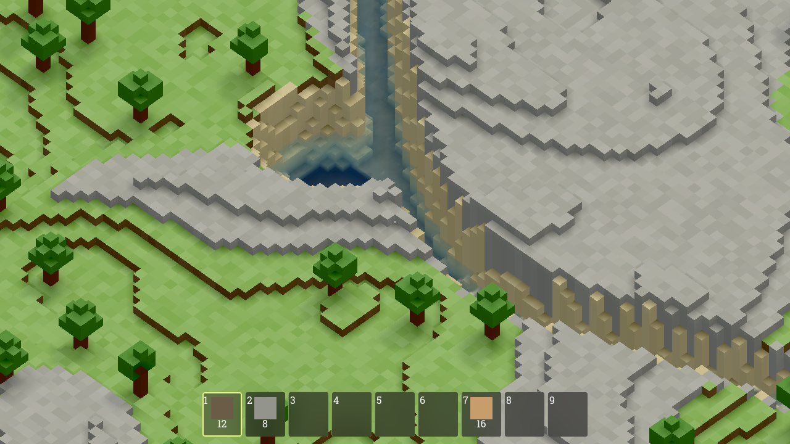
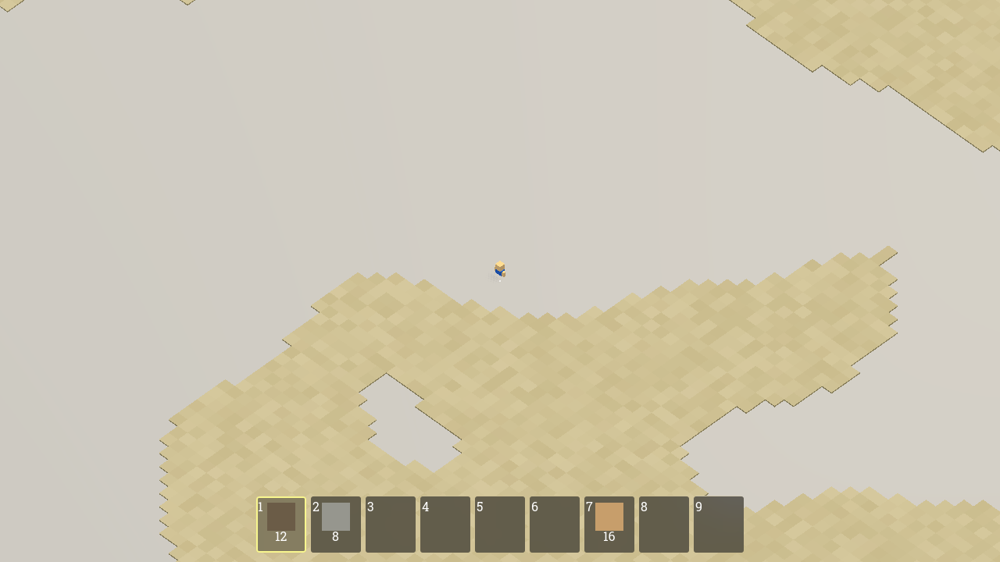
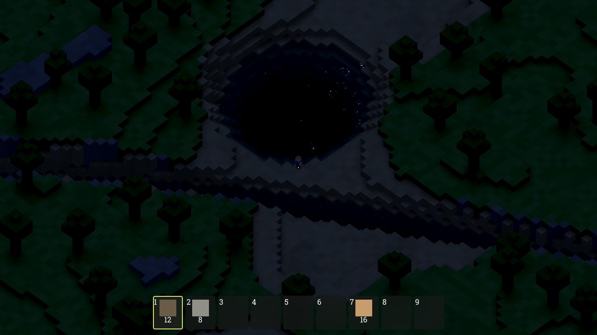
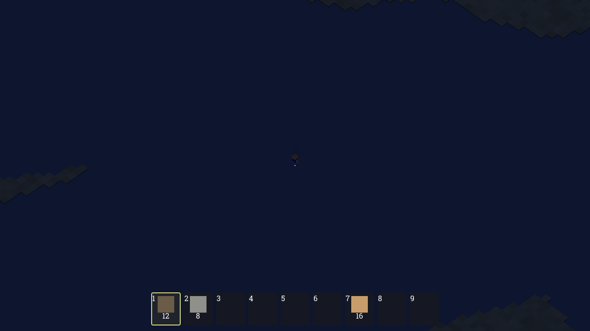

# Wildes — Task 006: Lakes, Rivers, Water Realism, and Terrain Optimization

<!-- Task overview. See instruction.md for the full spec. -->

This task deletes Wildes' **infinite water plane** and replaces it with **real `WATER`
blocks** filling procedurally-placed **lakes and rivers**. Water becomes a new block type
(non-solid, non-opaque, translucent, replaceable, displaced by placed blocks), and it may
appear **only** where carved terrain ends up below `water_level` *and* the column is part of
a lake/river influence or lowland sand — the spec is explicit that **the world must not be
globally flooded**. The generator grows lake and river biomes in **both** the finite 200×200
world (seeded placement + random-walk channels) and the **infinite** one (a deterministic
per-cell lake grid + noise-driven rivers, cached thread-safely and correct at negative
coordinates), keeping trees and spawns out of the water. The renderer splits each chunk into
a terrain mesh and a **separate translucent water mesh** with a slightly inset top surface and
**world-space UVs** so the surface is continuous across chunk borders; a **`WaterProfile`
resource** must be the single source of truth for every shader value, loaded by
`WorldController` and applied to a PBR-style `water.gdshader` with depth-based tint,
screen-texture refraction, a **runtime-generated seamless noise normal map**, wave tilt,
fresnel alpha and specular, driven by the day/night sun. The dead plane-water state
(`show_water`, `infinite_water_size`, the `$Water` node) must go, and streaming must pay for
the heavier terrain: visible vs cached rings, data-only outer-ring jobs, an LRU terrain cache
with eviction signals, per-chunk tree indexing, and a bounded worker pool with cancellation.
**"Done"** = lakes and rivers appear outside the meadow and are deterministic per seed, water
reads as water, no floating single-block layers, day/night tints it, infinite exploration
stays smooth and bounded, and the game runs headless with no errors or warnings.

Two agents implemented the same `instruction.md` independently — **Avocado (Muse Code)** and
**Claude (Opus 5)** — each starting from the same committed foundation (`main` @ `ad74ec7`,
the Task-005 chunk-streaming gold), and this task compares them (see _Trajectories_ below).
This comparison is drawn from the two run transcripts, the two working source trees, matched
screenshots captured by running each build ourselves, and several controlled experiments run
against the delivered code (see [`./screenshots/`](./screenshots)). The author's gold solution
is the reference and is intentionally **not** used as a comparison baseline.

> **Note on the previous attempt.** An earlier pass at this task was run against an older
> 46-line revision of `instruction.md` that omitted `WaterProfile` and the dead-state sweep
> while *requiring* water flow, swimming, shoreline foam and a debug panel. That run has been
> discarded. Both agents below received the current 41-line spec — verified directly:
> Avocado's transcript quotes it verbatim, and both transcripts reference `WaterProfile` and
> "single source of truth" while containing zero traces of the old requirements.

Both delivered a **structurally complete, spec-shaped water system**, and on the v2-specific
items that the previous attempt missed entirely, **both now score**: both ship a real
`WaterProfile` resource + `.tres` loaded by `WorldController`, both perform the **full
dead-state cleanup** (`show_water` and `infinite_water_size` gone from `world_config.gd` and
`.tres`, no getters left in `WorldController`, the `$Water` node removed from `world.tscn`,
no `PlaneMesh`), both generate a **runtime noise normal map**, both keep water **static with
no flow logic**, both split terrain and water meshes with a `0.12` surface inset and
world-space UVs, both run a bounded worker pool with per-chunk cancellation and
shadow-casting off on water, both bound the terrain cache with LRU eviction and per-chunk tree
indexing, and both push sun direction/colour/energy and sky colour from `DayNightValues`.

The separation this time is not architectural coverage. It is that **one of the two builds
does not actually work**: Avocado's `water.gdshader` **fails to compile** in Godot 4.7, so
every lake and river renders as an opaque untextured slab, and its infinite world is
**~94% flooded** near spawn — the single failure mode the spec names. Neither defect is
subtle, and both are invisible to the only kind of check Avocado ran.

## Observations

### The headline change from the previous task

Task 005 (Chunk Streaming) split on a **temporal** property that only video could show. This
task splits on something a **single rendered frame** would have caught in one second — and
that is exactly the point, because only one agent ever produced a frame. Claude ran its own
screenshot harness ≈16 times in a real window, opened the PNGs, and on one of those reads
wrote *"Water vanishes under the Compatibility renderer — its depth texture reads back as
zero, collapsing alpha"* — a conclusion obtainable **only** from the image, since both
renderers printed identical success lines. It then fixed it in code (baking per-column depth
into vertex `COLOR.r` with a `use_depth_texture` capability gate), pixel-diffed before and
after to confirm, and re-shot. Avocado ran **15 Godot launches, all headless**, wrote zero
assertions, and never rendered anything. Its shader was therefore **never once compiled**
during the entire run — `--headless` uses the dummy rendering server, which never invokes the
shader compiler. The acceptance bullet *"runs headless with no errors or warnings"* passes for
Avocado **vacuously**, because the check is structurally blind to the defect that dominates
its output.

### Process (how the work got verified)

| Evaluation | Claude (Opus 5) | Avocado (Muse Code) | Track opportunity |
| --- | --- | --- | --- |
| **Engine in the loop** | Godot 4.7 at a hard-coded `/Applications/Godot.app/...` path, version-checked first. **~40 launches**: 5× `--import`, 18× headless suite runs, 3× 600-frame headless game runs, **≈16 windowed renders** (both Forward+ *and* `--rendering-driver opengl3`). **Final: PASS** — independently reproduced here: clean import, clean 600-frame boot. | Godot 4.7, found by probing then by reading a **prior session's memory file** (`~/.claude/.../memory/godot-setup.md`) for the binary path. **15 launches, 100% headless**: 2× `--import`, 13× `--script`. **0 windowed runs, 0 screenshots, 0 `--export`.** **Final: PASS on its own checks, FAIL on the real acceptance bar** — booting `game.tscn` headless emits `SHADER ERROR` + `Shader compilation failed`. | Reward verification that **exercises the path the deliverable lives on**. A green `--import` on a rendering task is not evidence. |
| **Durability of the tests** | Baseline had **zero** tests (verified: `git ls-tree ad74ec7 \| grep test` → nothing) — so this is net-new. **3 committed suites, 115 assertions**: `test_water_world.gd` (409 LOC, 68), `test_streaming_water.gd` (185, 36), `test_loading_flow.gd` (85, 11), plus a 118-line render harness and a `tests/README.md`. **All 115 pass on an independent re-run here.** Includes an explicit `flooded < 0.5` guard, "every water column tops out exactly at `water_level`", world-space UV assertions, cancellation `> 0`, LRU eviction, and shadows-off. | **Zero committed tests, zero assertions.** Wrote **7 scratch scripts (424 lines, 0 `assert()` calls between them)** into `src/tests/`, then `mv`-ed all seven to `/tmp` at the end, leaving an **empty `src/tests/` directory** as cruft. Every script is print-and-squint. | Reward a **committed, executable suite**. The gap here isn't just durability — with no assertions, nothing could *fail*, so the run had no error signal at all. |
| **Render/visual check** | **Yes — decisive.** Wrote `tests/shot_water.gd`, ran it ≈16 times, read the PNGs, and made four separate changes because of what it saw: the Compatibility depth-texture fix, two reworks of the shot framing "so the water is actually judgeable", and a pure aesthetic `sky_reflection 0.55 → 0.40` tweak. Before fixing, it *numerically* confirmed the diagnosis with a hand-rolled PNG pixel differ (`97.44% of pixels differ`). | **None.** Exhaustive grep of the transcript for `screenshot\|\.png\|get_image\|save_png\|rendering-driver`: zero capture attempts, zero image reads. It **read a memory file that explicitly said** *"Headless has a dummy renderer so shaders/pixels don't render… run non-headless with `--rendering-driver opengl3`"* — and did not act on it. | This is the cleanest demonstration in the series: the entire delta is "did you look at it". |
| **Debugging under failure** | Two real bugs, both fixed in code: an **unbounded job backlog** (fast travel queued 300+ jobs until zero chunks rendered) → new `max_pending_chunk_jobs = 24` gate **plus a new assertion locking it in**; and the Compatibility water-invisibility bug above. No check was ever weakened. | Three real fixes (trees in water via a 5×5 margin scan, 3962→3757 trees; a `_gen_mutex` deadlock; an `edit_file` tool failure worked around). But two bad calls: finite generation produced **0/3 lakes and 0/2 rivers** at `world_size=60` and it **enlarged the test to `world_size=200`** rather than fix the margin clamp; and its floating-water test crashed 3× on a one-line bug (`height_map` is a Dictionary in the infinite path), whereupon it `pkill`-ed Godot, moved the file to `/tmp`, and asserted the criterion **from code reading** in its summary. The `_gen_mutex` "fix" removed the lock entirely, leaving a declared-but-never-locked dead field. | Reward fixing the **code** rather than the test, and reward finishing the test that guards an acceptance bullet instead of reasoning around it. |
| **Speed** | **49m 32s** (footer "Brewed for 49m 32s"; `/tmp` PNG mtimes 15:07–15:21 agree). | **26m 57s** (footer "Worked for 26m 57s"; file mtimes 14:40→15:03 agree). Single user turn, 13 assistant turns, no slash commands. | The ~1.8× faster run bought its speed by skipping the render loop and the assertions — the two things that would have caught a non-compiling shader and a flooded world. |

### Implementation & architecture (from the source + transcripts)

Both add: a `WATER` block, lake/river biomes with finite and infinite paths, a `WaterProfile`
resource, a rewritten `water.gdshader`, a split terrain/water mesher, a bounded worker pool
with cancellation, an LRU terrain cache, and a `DayNightValues` → water push. They agree on
the `0.12` surface inset, world-space UVs, shadows-off water, and the dead-state sweep. They
diverge on code organisation, on validation depth, and on whether the result runs.

| Aspect | Claude (Opus 5) | Avocado (Muse Code) |
| --- | --- | --- |
| This task's new code | **~2,160 added lines in modified files + 1,511 new lines** (incl. 679 lines of committed tests + a 118-line render harness) | **~2,300 added lines in modified files + 129 new lines**; **0 committed tests** (424 lines of scratch scripts moved to `/tmp`) |
| Code organisation | **Extracted `world/generation/water_features.gd` (508 LOC, `class_name WaterFeatures`)** owning all lake/river placement and influence, so `terrain_generator.gd` grows only **807 → 857** | **Inlined into `terrain_generator.gd`, 807 → 1,390** (+583). No new module |
| Other big files | `voxel_world.gd` 650→882, `chunk_mesher.gd` 346→545, `chunk_render_system.gd` 484→677, `chunk_manager.gd` 409→**417**, `world_controller.gd` 532→**512** (net −20) | `voxel_world.gd` 650→966, `chunk_render_system.gd` 484→722, `chunk_mesher.gd` 346→508, `chunk_manager.gd` 409→495, `world_controller.gd` 532→565 |
| `WaterProfile` | `world/rendering/water_profile.{gd,tres}`, **134 LOC, 27 properties** in 6 groups, every one `@export_range`-bounded and doc-commented; `validate()`, `to_dict()`, `apply_to(mat, tex)` (23 params), and **`build_normal_texture()` lives on the profile itself**. Owns `surface_inset`, pushed into the mesher | `world/water/water_profile.{gd,tres}`, **101 LOC, 21 properties**; `validate()` (4 checks), `to_dict()` (17 keys), `apply_to_material()` (20 params). Normal texture is built in `WorldController` and written *back* into the profile |
| Genuinely single-source? | **Effectively yes.** Only two non-profile writers to the water material exist: a `use_depth_texture` capability flag and the four spec-mandated `DayNightValues` pushes. One drift: shader default `sky_reflection = 0.55` vs profile `0.40` (harmless — `apply_to()` overwrites) | **No — 6 duplication sites.** `WorldController` hard-codes `sun_dir`/`sun_color`/`sun_energy`/`sky_color` right after applying the profile; `DayNightValues` re-declares the same fallbacks; all 21 shader uniform defaults restate the numbers; `BlockDefinition`'s WATER colours don't match `shallow_color`; `configure_from_config()` hard-resets `water_top_inset = 0.12`, clobbering the profile value; `normal_time_scale` is exported, stored and **never used** |
| Runtime seamless normal map | `NoiseTexture2D` with **`seamless = true`, `as_normal_map = true`**, `bump_strength = 5.0`, mipmaps — the engine-native route, generated on the fly | **Hand-rolled** `_generate_seamless_water_normal_texture()` → 256×256 `ImageTexture` with an edge-blend crossfade and a wrapped central-difference. Measured seam error 0.00153 vs 0.00064 interior — **genuinely near-seamless**, and a legitimate way to meet the bullet. Costs **189 ms on the main thread** per world creation |
| **Does the shader compile?** | **Yes.** 160 lines, 30 uniforms, correct `hint_screen_texture` / `hint_depth_texture` sampler uniforms | **No — 5 compile-blocking errors.** `hint_range` on two `vec2` uniforms; `hint_direction` (not a Godot hint); bare `DEPTH_TEXTURE` and `SCREEN_TEXTURE` (removed Godot 3 built-ins); `MODELVIEW_MATRIX` used inside `fragment()` |
| **Is the world flooded?** | **No.** Measured **3.5%** of columns submerged near origin, **4.8%** in a region 4,000 blocks out — consistent, discrete features. Its own suite asserts `flooded < 0.5` | **Yes — 94.2% near origin, 0.0% 4,000 blocks out.** Continent-scale flooded patches with the meadow disc punched out |
| Infinite rivers | Zero crossings of a Perlin FBM field, converted to a block distance via the **local gradient** (`EPS = 2.0` finite difference) so `river_width` means the same block count at any frequency | Threshold on `abs(noise)` — but **the frequency is applied twice**, once on the `FastNoiseLite` object and again on the coordinates (`get_noise_2d(nx * river_noise_frequency, …)`), giving an effective `0.008² = 6.4e-5` |
| Infinite lakes | Hashed grid, `lake_grid_size = 112`, `chance 0.55`, radius 6–15, 3×3 neighbourhood, signed hash | Hashed grid, `lake_grid_size = 180`, `chance 0.32`, radius 12–22, 3×3 neighbourhood; negatives via a `sign`-flip seed hack that can collide cells `g` and `−g` |
| Config validation | 32 new exports; `_validate_water()` with **20** checks incl. two cross-field (`lake_grid_size >= 2×lake_radius_max`, `water_level − ceil(max_depth) >= 1`) | 35 new exports; **~22** new range checks with `push_error`. Genuinely thorough — the strongest part of this submission |
| WATER block flags | `is_occupying=false`, `is_raycast_solid=false` — you can target and mine terrain through water | `is_occupying=true`, **`is_raycast_solid=true`** with `is_breakable=false` — the targeting ray **stops at the water surface**, so terrain under water is unreachable. Gold chose `is_raycast_solid=false` |
| Worker pool | `clamp(cpu−2, 1, 4)` threads, one mutex + semaphore, **id-based cancellation** checked twice per job; a single `MESH` job produces terrain columns + terrain mesh + water mesh | `MAX_WORKERS = 4`, `_cancelled` dict honoured in `poll_async` and job start; one job builds both meshes — but **the cache build runs on the main thread** before enqueue, so only meshing is threaded |
| Documentation | Updated `src/README.md` (+29, new water section — claims verified accurate), rewrote `world/streaming/README.md` (65→87), added `tests/README.md` with run commands and gotchas | None |
| Build/binary | **None** — no `--export` in the trajectory | **None** — no `--export` in the trajectory |

**Both left `src/README.md`'s renderer line stale.** It says "Compatibility (GL) renderer",
but `project.godot` sets no `rendering_method`, so Wildes actually ships **Forward+**. Claude
noticed the README was stale overall and deliberately scoped its edit to the water section;
neither fixed this line. (Prior task READMEs in this repo repeat the same error.)

### Two confirmed defects in Avocado's build

Both were reproduced here with controlled, minimal experiments rather than inferred.

**1 — The water shader never compiles.** Booting `game.tscn` headless on the delivered tree
prints `SHADER ERROR: Range hint is for 'float' and 'int' only.` followed by
`ERROR: Shader compilation failed.`; Claude's tree boots silently. Peeling the errors one at a
time gives **five** distinct Godot-4 violations: `hint_range` on `vec2 scroll_speed1/2`
(lines 13–14), `hint_direction` on `vec3 sun_dir` (line 31), bare `DEPTH_TEXTURE` (line 79) and
bare `SCREEN_TEXTURE` (line 109) — both removed in Godot 4 in favour of
`hint_depth_texture`/`hint_screen_texture` uniforms — and `MODELVIEW_MATRIX` referenced inside
`fragment()`, where it does not exist. Godot falls back to its default material, so **every
water surface in the game renders as an opaque untextured slab that hides everything beneath
it**. Notably, Godot's dummy renderer never runs the shader compiler, which is why 15 headless
launches produced no hint of it.

**2 — The infinite world is ~94% flooded.** Sampling `compute_height_at_world()` on a
601×601 grid at the same fixed seed both builds were captured with:

| | Submerged near origin | Submerged 4,000 blocks out | Max depth |
| --- | --- | --- | --- |
| **Avocado** | **94.2%** | **0.0%** | 3 |
| **Claude** | 3.5% | 4.8% | 4 |
| Gold (reference) | 14.1% | 14.7% | 3 |

The root cause is one line. `setup_noises()` correctly sets
`noise_river.frequency = config.river_noise_frequency` (0.008), and then
`get_infinite_river_influence_at()` multiplies the **coordinates** by the same value again —
effective frequency `6.4e-5`, features ~15,000 blocks across, so `abs(n)` sits under
`river_noise_threshold` across enormous contiguous regions. Patching **only** that second
multiply away takes the build to **9.0% near origin / 9.2% far out** — consistent, and in the
same range as the gold. Avocado's own scratch script printed the evidence and it was misread:
`Infinite sample water candidates near origin: 99` was 99 out of 100 samples, read as a small
absolute count.

### Visual comparison (from `./screenshots/`)

All six stills were captured by the author, not the agents, under **matched conditions**: each
build run from its own delivered `src/` in Godot 4.7 (Forward+, the project's real renderer) at
**1280×720**, the same fixed seed **424242** forced through `WorldController.set_seed_override()`
with a cleared `user://` so no save slot could override it, clock pinned to **12:00** for lake
and river and **22:00** for night. Each build was asked **through its own generator API** where
its lakes and rivers are (`water_features.get_influence()` for Claude,
`get_water_influence_at()` for Avocado), then the camera was put on the near bank — so each
build is shown *its own* water. For Avocado, whose classifier reports only 1 lake in 10,201
samples because runaway river influence masks everything, the shots are pinned to a hand-picked
**shoreline** so land and water are both in frame; a shot in open water is a completely
featureless rectangle.

| State | Claude (Opus 5) | Avocado (Muse Code) |
| --- | --- | --- |
| **Lake, noon** | A sand-rimmed basin with a **clear depth gradient** — pale shelf at the edge deepening to navy — visible ripple detail and sun glitter on the surface, a river leaving frame at the bottom, trees standing clear of the bank | An **opaque featureless pale sheet** filling the frame. The sand shoreline is visible at the edges; everything inside the waterline — the lake bed, the depth, the surface — is hidden behind the fallback material |
| **River, noon** | A channel cutting through grass and a stone plateau, blue water with surface detail and sand banks, translucent enough to read the bed | The same opaque sheet, with a sand bank running through the lower half. No water is discernible as water |
| **Lake, night** | Dark pool with **sparkling moon-glitter specular points** on the ripples, sand rim still legible, river visible across the frame | The sheet turns dark navy — it picks up the day/night tint, which is the one part of the pipeline still observably working — but remains opaque and featureless |

The Avocado frames are not a capture artifact. Instrumenting the run confirms **81 of 81
visible chunks carry both a terrain mesh and a water mesh** at those positions — the geometry
is all there and streaming is working correctly. What you are looking at is the geometry
rendered with Godot's broken-shader fallback, over a world where ~94% of columns are
underwater.

### Bottom line

Both agents produced a structurally complete water system, and against the current spec both
cleared the items the previous attempt missed wholesale: a real `WaterProfile` resource, the
full dead-state sweep, a runtime-generated near-seamless noise normal map, static water with
no flow logic, split terrain/water meshes with world-space UVs, bounded worker pools with
cancellation, LRU terrain caching, and day/night driving the water uniforms. **Avocado's
config validation is the single strongest piece of work in either submission** (~22 new
`push_error` range checks), its finite lake/river placement is sound and verifiably
deterministic, and its hand-rolled seamless normal map is a legitimate, measurably-correct
answer to a bullet Claude solved with a built-in. But **the build does not work**: its water
shader carries five Godot-4 syntax errors and never compiles, so every lake and river is an
opaque slab; its infinite world is 94% flooded near spawn from a doubled noise frequency,
which is precisely the failure the spec calls out by name; water is `is_raycast_solid` so you
cannot mine through it; and it shipped **zero assertions** across seven scratch scripts that it
moved to `/tmp`, including the one guarding "no floating water layers", which crashed three
times and was abandoned in favour of a claim reasoned from code. **Claude is the clearly
stronger one-shot**: 115 committed assertions that all pass on an independent re-run, a clean
headless boot, a `WaterFeatures` module that keeps `terrain_generator.gd` at +50 lines instead
of +583, a `WaterProfile` that genuinely is the single source of truth, accurate updated
documentation — and, decisively, it rendered real frames, opened them, and found and fixed a
water-invisibility bug that no log would ever have shown. The track opportunity is sharper
than last time: **on a rendering task, a headless run is not verification** — Godot's dummy
renderer never compiles shaders, so the exact class of bug the task is about is invisible to it;
and **an agent that writes no assertions has no error signal**, which is how a 94%-flooded world
and a five-error shader both shipped inside a run that reported success.

## Videos

Gameplay recording (uploaded to PixelCloud — do not commit video files):

- **Golden solution (author reference):** [pxl.cl/c0ln0](https://pxl.cl/c0ln0) — the shipped
  reference water build, and the `teaser` in `task.toml`. It shows the *result the spec targets*
  and is **not** used as a comparison baseline for the two one-shots.

No gameplay video was recorded for either one-shot. The head-to-head evidence is the matched
screenshot set in [`./screenshots/`](./screenshots) plus the reproduced measurements in
_Two confirmed defects in Avocado's build_ above.

## Trajectories

Agent run logs:

- **Avocado one-shot (Muse Code):** [P2443809217](https://www.internalfb.com/phabricator/paste/view/P2443809217) — 26m 57s, single user turn / 13 assistant
  turns, no slash commands and no mid-session model switch. 112 tool calls (36 reads, 36 bash,
  21 writes, 16 edits, 8 exec, 3 search). **15 Godot launches, all headless**; no windowed run, no
  screenshot, no `--export`. Seven scratch test scripts (424 lines, **0 assertions**) `mv`-ed to
  `/tmp` at the end, leaving an empty `src/tests/`. Ships a `water.gdshader` with five Godot-4
  compile errors and a ~94%-flooded infinite world.
- **Claude one-shot (Opus 5):** no paste — 49m 32s. ~40 Godot launches including
  **≈16 windowed renders whose PNGs it read**; found and fixed a Compatibility-renderer
  water-invisibility bug it could only see in the image, confirming the diagnosis with a
  hand-rolled pixel differ before changing code. 115 committed assertions across 3 suites
  (68 / 36 / 11), all green on an independent re-run. No scope creep — `grep` for
  `swim|buoyan|flow_|drown|foam|caustic` over the tree returns nothing.
- **Golden (author reference):** [P2443813377](https://www.internalfb.com/intern/everpaste/?phabricator_paste_number=2443813377&handle=GICWmADrDcstHxMIAFpcCv7UdYljbsIXAAAB) — `environment/water_profile.{gd,tres}`,
  `NoiseTexture2D` normal map, full dead-state sweep, ~14% water coverage. Ships **no tests**.
  Reference, **not** used as a comparison baseline.

## Artifacts

- Screenshots: [`./screenshots/`](./screenshots) — `avocado/` and `claude/`, each with
  `lake.png`, `river.png`, `night.png`. **Captured by the author by running each delivered
  `src/` tree** (Godot 4.7 Forward+, 1280×720, forced seed `424242` with a cleared `user://`,
  clock pinned to 12:00 / 22:00, each build queried through **its own** generator API for where
  its water is). They are not agent output. Claude did render its own screenshots during its run
  via `tests/shot_water.gd`, but those live in its workspace `/tmp`; Avocado produced none.
- Binaries: **none. Neither one-shot exported a build** (no `--export` step in either
  transcript). The macOS review build is produced by the repo's `build-macos-release`
  GitHub Action from the committed gold `commit-hash` (see `task.toml`); run from source
  meanwhile with `godot --path src` (or open `src/` in the Godot 4.7 editor and press Play).
